Joint Survival and Marker Models
================

[](https://github.com/boennecd/VAJointSurv/actions)

This package provides means of estimating joint models for a mixture of
different types of markers and different types of survival outcomes. The
models are estimated with Gaussian variational approximations (GVAs).
Description of the supported models and multiple examples are given in
this document. A presentation of the package is available
[here](https://rpubs.com/boennecd/MEB-VAJointSurv) which includes a
simulation study to investigate bias of the parameter estimates and
coverage of approximate likelihood ratio based confidence intervals.

A comparison with the JM, JMbayes, and joineRML is provided on Github at
[github.com/boennecd/VAJointSurv/tree/main/comparisons](https://github.com/boennecd/VAJointSurv/tree/main/comparisons).

## Installation

The package can be installed from Github by calling:

``` r
remotes::install_github("boennecd/VAJointSurv", build_vignettes = TRUE)
```

The package currently requires the development version of the psqn
package. Thus, you need to install it, e.g. by calling

``` r
remotes::install_github("boennecd/psqn", build_vignettes = TRUE)
```

## The Model

We will start by covering the model, then cover some examples, and end
with details about the implementation.

### The Markers

We assume that there are

observed markers at each time point. We let  denote the
th
observed markers for individual
 and
let
 be the observation time. The model for the markers is

  
![\\begin{align\*}
\\vec Y\_{ij}&= \\vec\\mu\_i(s\_{ij}, \\vec U\_i) + \\vec\\epsilon\_{ij}
\\\\
\\epsilon\_{ij} &\\sim N^{(L)}(\\vec 0, \\Sigma) \\\\
\\mu\_{i1}(s, \\vec U\_i) &= \\vec x\_{i1}^\\top\\vec\\gamma\_1 + \\vec
g\_1(s)^\\top\\vec\\beta\_1 + 
\\vec m\_1(s)^\\top\\vec U\_{i1} \\\\
\\vdots &\\hphantom{=}\\vdots\\\\\\
\\mu\_{iL}(s, \\vec U\_i) &= \\vec x\_{iL}^\\top\\vec\\gamma\_L + \\vec
g\_L(s)^\\top\\vec\\beta\_L + 
\\vec m\_L(s)^\\top\\vec U\_{iL} \\\\
\\vec U\_i &= \\begin{pmatrix}
\\vec U\_{i1} \\\\ \\vdots \\\\ \\vec U\_{iL}
\\end{pmatrix}\\sim N^{(R)}(\\vec0, \\Psi) 
\\end{align\*}](https://render.githubusercontent.com/render/math?math=%5Cbegin%7Balign%2A%7D%0A%5Cvec%20Y_%7Bij%7D%26%3D%20%5Cvec%5Cmu_i%28s_%7Bij%7D%2C%20%5Cvec%20U_i%29%20%2B%20%5Cvec%5Cepsilon_%7Bij%7D%20%5C%5C%0A%5Cepsilon_%7Bij%7D%20%26%5Csim%20N%5E%7B%28L%29%7D%28%5Cvec%200%2C%20%5CSigma%29%20%5C%5C%0A%5Cmu_%7Bi1%7D%28s%2C%20%5Cvec%20U_i%29%20%26%3D%20%5Cvec%20x_%7Bi1%7D%5E%5Ctop%5Cvec%5Cgamma_1%20%2B%20%5Cvec%20g_1%28s%29%5E%5Ctop%5Cvec%5Cbeta_1%20%2B%20%0A%20%20%5Cvec%20m_1%28s%29%5E%5Ctop%5Cvec%20U_%7Bi1%7D%20%5C%5C%0A%5Cvdots%20%26%5Chphantom%7B%3D%7D%5Cvdots%5C%5C%5C%0A%5Cmu_%7BiL%7D%28s%2C%20%5Cvec%20U_i%29%20%26%3D%20%5Cvec%20x_%7BiL%7D%5E%5Ctop%5Cvec%5Cgamma_L%20%2B%20%5Cvec%20g_L%28s%29%5E%5Ctop%5Cvec%5Cbeta_L%20%2B%20%0A%20%20%5Cvec%20m_L%28s%29%5E%5Ctop%5Cvec%20U_%7BiL%7D%20%5C%5C%0A%5Cvec%20U_i%20%20%26%3D%20%5Cbegin%7Bpmatrix%7D%0A%20%20%20%20%5Cvec%20U_%7Bi1%7D%20%5C%5C%20%5Cvdots%20%5C%5C%20%5Cvec%20U_%7BiL%7D%0A%20%20%5Cend%7Bpmatrix%7D%5Csim%20N%5E%7B%28R%29%7D%28%5Cvec0%2C%20%5CPsi%29%20%0A%5Cend%7Balign%2A%7D
"\\begin{align*}
\\vec Y_{ij}&= \\vec\\mu_i(s_{ij}, \\vec U_i) + \\vec\\epsilon_{ij} \\\\
\\epsilon_{ij} &\\sim N^{(L)}(\\vec 0, \\Sigma) \\\\
\\mu_{i1}(s, \\vec U_i) &= \\vec x_{i1}^\\top\\vec\\gamma_1 + \\vec g_1(s)^\\top\\vec\\beta_1 + 
  \\vec m_1(s)^\\top\\vec U_{i1} \\\\
\\vdots &\\hphantom{=}\\vdots\\\\\\
\\mu_{iL}(s, \\vec U_i) &= \\vec x_{iL}^\\top\\vec\\gamma_L + \\vec g_L(s)^\\top\\vec\\beta_L + 
  \\vec m_L(s)^\\top\\vec U_{iL} \\\\
\\vec U_i  &= \\begin{pmatrix}
    \\vec U_{i1} \\\\ \\vdots \\\\ \\vec U_{iL}
  \\end{pmatrix}\\sim N^{(R)}(\\vec0, \\Psi) 
\\end{align*}")  

where
 is an error term of the observation,  is the

dimensional unobserved random effect for individual
, and
the s and s are basis expansions. We can write the model more
compactly by letting

  
 = \\begin{pmatrix} 
  \\vec g_1(s)^\\top & 0^\\top & \\cdots & \\vec 0^\\top \\\\
  \\vec 0^\\top & \\vec g_2(s)^\\top & \\ddots & \\vdots \\\\
  \\vdots & \\ddots & \\ddots & \\vec 0^\\top \\\\
  \\vec 0^\\top & \\cdots & \\vec 0^\\top & \\vec g_L(s)^\\top \\end{pmatrix}")  

and defining
") and

similarly. Furthermore, let ") and
define
 similarly. Then the conditional mean vector at time
 is

  
 = X_i\\vec\\gamma + G(s_{ij})\\vec\\beta + M(s_{ij})\\vec U_i.")  

### The Survival Outcomes

We assume that there are

different types of survival outcomes. The conditional hazards of the
survival outcomes are

  
![\\begin{align\*}
h\_{i1}(t\\mid \\vec U\_i, \\vec\\xi\_i) &= \\exp\\left( 
\\vec z\_{i1}^\\top\\vec \\delta\_1 + 
\\omega\_1^\\top \\vec b\_1(t) + 
\\vec\\alpha\_1^\\top M(t)\\vec U\_i + \\xi\_{i1}
\\right) \\\\
\\vdots &\\hphantom{=}\\vdots \\\\
h\_{iH}(t\\mid \\vec U\_i,\\vec \\xi\_i) &= \\exp\\left( 
\\vec z\_{iL}^\\top\\vec \\delta\_H + 
\\omega\_H^\\top\\vec b\_H(t) + 
\\vec\\alpha\_H^\\top M(t)\\vec U\_i + \\xi\_{iH}
\\right) \\\\
\\vec\\xi\_i = \\begin{pmatrix}\\xi\_{i1} \\\\ \\vdots \\\\
\\xi\_{iH}\\end{pmatrix}
&\\sim N^{(H)}(\\vec 0, \\Xi).
\\end{align\*}](https://render.githubusercontent.com/render/math?math=%5Cbegin%7Balign%2A%7D%0Ah_%7Bi1%7D%28t%5Cmid%20%5Cvec%20U_i%2C%20%5Cvec%5Cxi_i%29%20%26%3D%20%5Cexp%5Cleft%28%20%0A%20%20%5Cvec%20z_%7Bi1%7D%5E%5Ctop%5Cvec%20%5Cdelta_1%20%2B%20%0A%20%20%5Comega_1%5E%5Ctop%20%5Cvec%20b_1%28t%29%20%2B%20%0A%20%20%5Cvec%5Calpha_1%5E%5Ctop%20M%28t%29%5Cvec%20U_i%20%2B%20%5Cxi_%7Bi1%7D%0A%20%20%5Cright%29%20%5C%5C%0A%5Cvdots%20%26%5Chphantom%7B%3D%7D%5Cvdots%20%5C%5C%0Ah_%7BiH%7D%28t%5Cmid%20%5Cvec%20U_i%2C%5Cvec%20%5Cxi_i%29%20%26%3D%20%5Cexp%5Cleft%28%20%20%0A%20%20%5Cvec%20z_%7BiL%7D%5E%5Ctop%5Cvec%20%5Cdelta_H%20%2B%20%0A%20%20%5Comega_H%5E%5Ctop%5Cvec%20b_H%28t%29%20%2B%20%0A%20%20%5Cvec%5Calpha_H%5E%5Ctop%20M%28t%29%5Cvec%20U_i%20%2B%20%5Cxi_%7BiH%7D%0A%20%20%5Cright%29%20%5C%5C%0A%5Cvec%5Cxi_i%20%3D%20%5Cbegin%7Bpmatrix%7D%5Cxi_%7Bi1%7D%20%5C%5C%20%5Cvdots%20%5C%5C%20%5Cxi_%7BiH%7D%5Cend%7Bpmatrix%7D%0A%20%20%26%5Csim%20N%5E%7B%28H%29%7D%28%5Cvec%200%2C%20%5CXi%29.%0A%5Cend%7Balign%2A%7D
"\\begin{align*}
h_{i1}(t\\mid \\vec U_i, \\vec\\xi_i) &= \\exp\\left( 
  \\vec z_{i1}^\\top\\vec \\delta_1 + 
  \\omega_1^\\top \\vec b_1(t) + 
  \\vec\\alpha_1^\\top M(t)\\vec U_i + \\xi_{i1}
  \\right) \\\\
\\vdots &\\hphantom{=}\\vdots \\\\
h_{iH}(t\\mid \\vec U_i,\\vec \\xi_i) &= \\exp\\left(  
  \\vec z_{iL}^\\top\\vec \\delta_H + 
  \\omega_H^\\top\\vec b_H(t) + 
  \\vec\\alpha_H^\\top M(t)\\vec U_i + \\xi_{iH}
  \\right) \\\\
\\vec\\xi_i = \\begin{pmatrix}\\xi_{i1} \\\\ \\vdots \\\\ \\xi_{iH}\\end{pmatrix}
  &\\sim N^{(H)}(\\vec 0, \\Xi).
\\end{align*}")  

The
s are association parameters which makes the markers and
the survival outcomes marginally dependent. The
s are frailty effects which makes the survival outcomes
marginally dependent even if .

The observation process, the
s, can be modeled as one of

different types of survival process. This can be done by adding each
 as a left-truncated outcome of the given type of process
except for
 which is not left-truncated.

#### More General Survival Sub-model

The conditional hazards shown above only allows the hazard to be
associated with the population deviation for the mean marker through the
current value

  
\\vec U_i = \\begin{pmatrix}
    \\vec m_1(t)^\\top\\vec U_{i1} \\\\
    \\vdots \\\\
    \\vec m_L(t)^\\top\\vec U_{i1}
  \\end{pmatrix}.")  

However, the researcher may be interested in using the cumulative value,
^\\top ds\\vec U_{ik}"), the derivative,
^\\top\\vec U_{ik}/\\partial t"), or a combination
of these and the current value. This is supported in the package through
the `ders` argument of `surv_term`. As an example, if we let  = \\int^t \\vec m_k(s) ds"),  = \\partial\\vec m_k(t)/\\partial t"), and  then it is possible to replace the \\vec U_i") in the hazard with

  
^\\top \\vec U_{i1} \\\\
  \\vec m_1(t)^\\top \\vec U_{i1} \\\\
  \\vec m_2(t)^\\top \\vec U_{i2} \\\\
  \\vec d_3(t)^\\top \\vec U_{i3} \\\\
  \\vec r_3(t)^\\top \\vec U_{i3} \\\\
\\end{pmatrix}")  

That is, a cumulative and current value for the first marker, only the
current value for the second marker, and the cumulative and derivative
for the third marker.

### Model Support

The package can handle

  - Mixed type of basis expansions in
    ,
    ,
    and
    .
  - A maximum  different markers, and an arbitrary number survival
    outcome types,
    
    (though, identification of parameters quickly becomes an issue).
  - Only observing a subset of the
    
    markers at a given point in time
     (i.e. some may be missing).
  - Any number of observed markers and survival outcomes for each
    individual.
  - Left-truncation and right-censoring.

The following is not supported

  - Interval-censoring and left-censoring are not supported although
    this is not a complicated extension.
  - There cannot be multiple observed markers of the same type at each
    point
     for each individual
    .
  - There cannot be time-varying effects for a covariate. This is not
    too complicated to implement but not yet implemented.
  - Competing events, and multi-state models are not supported.

## Examples

We show a few examples of using this package and illustrate its API in
this section. The examples includes:

  - Only one marker in the [Univariate Marker
    Example](#univariate-marker-example) section where we can compare
    with lme4. The section also includes some remarks about the
    implemented expansions.
  - Two markers in the [Two Markers](#two-markers) section.
  - A recurrent event in the [Recurrent Event](#recurrent-event)
    section. It is also shown how to change the quadrature rule that is
    used to approximate the approximate expected cumulative hazard.
  - An example with two markers and a recurrent event is given in the
    [Two Markers and a Recurrent
    Event](#two-markers-and-a-recurrent-event) section. The section also
    includes an example of how to construct approximate profile
    likelihood based confidence intervals.
  - An example with two markers, the observation process, and a terminal
    event is given in the [Two Markers, the Observation Time Process,
    and a Terminal
    Event](#two-markers-the-observation-time-process-and-a-terminal-event)
    section. The observation time process and the markers are not
    marginally independent in the true model. Thus, they need to be
    modeled together or the dependence accounted for in some other way.
    Examples and comments regarding caching of the expansions are also
    provided.
  - A similar example is provided in the [Two Markers, the Observation
    Time Process, a Terminal Event and Mixed
    Dependencies](#two-markers-the-observation-time-process-a-terminal-event-and-mixed-dependencies)
    section but where a mixture of the cumulative, the present value,
    and the derivative is used in the sub-survival models.

### Univariate Marker Example

We make a comparison below with one marker only with the lme4 package.
We do this as we can check that

  - We get almost the same (the lower bound can be equal to the log
    marginal likelihood in this case).
  - The lower bound is less than or equal to the log marginal
    likelihood.

lme4 should be used in this case as the linear model is tractable and
this is used by the lme4 package. The computation time comparison is not
fair as we use four threads with the methods in this package.

``` r
# settings for the simulation
library(splines)
g_func <- function(x)
  ns(x, knots = c(.5, 1.5), Boundary.knots = c(0, 2))
m_func <- function(x)
  ns(x, knots = 1, Boundary.knots = c(0, 2), intercept = TRUE)

fixef_vary_marker <- c(1.4, -1.2, -2.1) # beta
fixef_marker <- c(-.5, 1) # gamma

# Psi 
vcov_vary <- structure(
  c(0.18, 0.05, -0.05, 0.05, 0.34, -0.25, -0.05, -0.25, 0.24), 
  .Dim = c(3L, 3L))
vcov_marker <- matrix(.6^2, 1) # Sigma

# plot the true mean curve along with 95% confidence pointwise quantiles
library(VAJointSurv)
par(mar = c(5, 5, 1, 1))
plot_marker(
  time_fixef = ns_term(
    knots = c(.5, 1.5), Boundary.knots = c(0, 2)),
  time_rng = ns_term(
    knots = 1, Boundary.knots = c(0, 2), intercept = TRUE), 
  fixef_vary = fixef_vary_marker, x_range = c(0, 2), vcov_vary = vcov_vary)
```

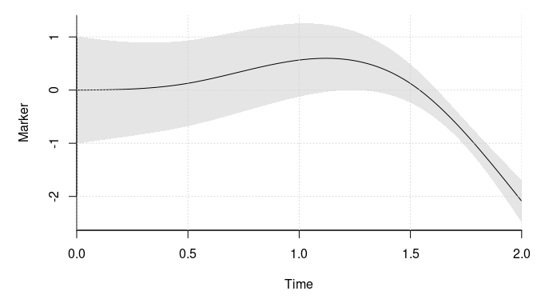<!-- -->

``` r
library(mvtnorm)
# simulates from the model by sampling a given number of individuals
sim_dat <- function(n_ids){
  # simulate the outcomes
  sig_sqrt <- sqrt(vcov_marker)
  dat <- lapply(1:n_ids, function(id){
    # sample the number of outcomes and the fixed effect covariates
    n_obs <- sample.int(8L, 1L)
    obs_time <- sort(runif(n_obs, 0, 2))
    X <- cbind(1, rnorm(n_obs))
    colnames(X) <- paste0("X", 1:NCOL(X) - 1L)
    
    # sample the outcomes
    U <- drop(rmvnorm(1, sigma = vcov_vary))
    eta <- X %*% fixef_marker + drop(g_func(obs_time)) %*% fixef_vary_marker + 
      drop(m_func(obs_time)) %*% U
    y <- drop(eta) + rnorm(n_obs, sd = sig_sqrt)
    
    cbind(y = y, X = X[, -1, drop = FALSE], time = obs_time, id = id)
  })
  
  # combine the data and return
  out <- as.data.frame(do.call(rbind, dat))
  out$id <- as.integer(out$id)
  out[sample.int(NROW(out)), ] # the order does not matter
}

# sample a moderately large data set
set.seed(2)
dat <- sim_dat(2000L)

# the number of observed outcomes
nrow(dat)
#> [1] 8992

# example of one individual's outcomes
subset(dat, id == 1)
#>         y       X1   time id
#> 5 -3.6206 -0.23970 1.8877  1
#> 2  0.1270 -0.08025 1.1467  1
#> 3 -0.3545  0.13242 1.4047  1
#> 1 -1.1089 -1.13038 0.3361  1
#> 4 -0.2127  0.70795 1.8869  1

# fit the model with lme4
library(lme4)
#> Loading required package: Matrix
system.time(
  fit <- lmer(y ~ X1 + g_func(time) + (m_func(time) - 1| id), dat, 
              control = lmerControl(optimizer = "bobyqa"),
              # to compare with the lower bound from this package
              REML = FALSE))
#>    user  system elapsed 
#>   0.839   0.008   0.856

# the maximum log likelihood
print(logLik(fit), digits = 8)
#> 'log Lik.' -9161.7723 (df=12)

# estimate the model with this package. Get the object we need for the 
# optimization
system.time(comp_obj <- joint_ms_ptr(
  markers = marker_term(
    y ~ X1, id = id, dat, 
    time_fixef = ns_term(time, knots = c(.5, 1.5), Boundary.knots = c(0, 2)),
    time_rng = ns_term(time, knots = 1, Boundary.knots = c(0, 2), 
                       intercept = TRUE)),
  max_threads = 4L))
#>    user  system elapsed 
#>   0.095   0.000   0.094

# get the starting values
system.time(start_val <- joint_ms_start_val(comp_obj))
#>    user  system elapsed 
#>   0.123   0.000   0.035

# lower bound at the starting values
print(-attr(start_val, "value"), digits = 8)
#> [1] -9787.9238

# check that the gradient is correct
f <- function(x){
  start_val[seq_along(x)] <- x
  joint_ms_lb(comp_obj, start_val)
}

all.equal(numDeriv::grad(f, head(start_val, 12 + 2 * 9)), 
          head(joint_ms_lb_gr(comp_obj, start_val), 12 + 2 * 9))
#> [1] TRUE

# find the maximum lower bound estimate
system.time(opt_out <- joint_ms_opt(comp_obj, par = start_val, max_it = 1000L,
                                    cg_tol = .2, c2 = .1))
#>    user  system elapsed 
#>   8.271   0.007   2.072
opt_out$info # convergence code (0 == 'OK')
#> [1] 0
print(-opt_out$value, digits = 8) # maximum lower bound value
#> [1] -9161.7762
print(logLik(fit), digits = 8) # maximum likelihood from lme4
#> 'log Lik.' -9161.7723 (df=12)

# find the maximum lower bound with lbfgs
library(lbfgsb3c)
system.time(lbfgs_res <- lbfgsb3c(
  start_val, function(x) joint_ms_lb(comp_obj, x),
  function(x) joint_ms_lb_gr(comp_obj, x), 
  control = list(factr = 1e-8, maxit = 5000L)))
#>    user  system elapsed 
#>  71.501   0.008  17.932
lbfgs_res$convergence # convergence code (0 == 'OK')
#> [1] 1
print(-lbfgs_res$value, digits = 8) # maximum lower bound value
#> [1] -9161.9881
lbfgs_res$counts # may have hit maxit!
#> [1] 5000 5000

# compare the estimates with the actual values. Start with the fixed effects
fmt_ests <- joint_ms_format(comp_obj, opt_out$par)
rbind(lme4 = fixef(fit),
      `This package` = do.call(c, fmt_ests$markers[[1]]), 
      Actual = c(fixef_marker, fixef_vary_marker))
#>              (Intercept)    X1 g_func(time)1 g_func(time)2 g_func(time)3
#> lme4             -0.5206 1.007         1.372        -1.104        -2.089
#> This package     -0.5207 1.007         1.372        -1.104        -2.089
#> Actual           -0.5000 1.000         1.400        -1.200        -2.100

# then the random effect covariance matrix
vcov_est <- VarCorr(fit)[["id"]]
attributes(vcov_est)[c("stddev", "correlation")] <- NULL
vcov_est # lme4
#>               m_func(time)1 m_func(time)2 m_func(time)3
#> m_func(time)1       0.16228       0.09634      -0.04534
#> m_func(time)2       0.09634       0.29559      -0.26821
#> m_func(time)3      -0.04534      -0.26821       0.29652
fmt_ests$vcov$vcov_vary # this package
#>          [,1]     [,2]     [,3]
#> [1,]  0.16424  0.09485 -0.04597
#> [2,]  0.09485  0.29675 -0.26757
#> [3,] -0.04597 -0.26757  0.29666
vcov_vary # the actual values
#>       [,1]  [,2]  [,3]
#> [1,]  0.18  0.05 -0.05
#> [2,]  0.05  0.34 -0.25
#> [3,] -0.05 -0.25  0.24

# the error term variance
c(lme4 = attr(VarCorr(fit), "sc")^2, 
  `This package` = fmt_ests$vcov$vcov_marker, 
  Actual = vcov_marker)
#>         lme4 This package       Actual 
#>       0.3667       0.3665       0.3600
```

#### Note on Basis Expansions

This is a technical section which you may skip. Special basis expansions
for e.g. `poly` and `ns` are implemented in R as `poly_term` and
`ns_term`. The reason is that the integration shown in the [Survival
Outcomes](#survival-outcomes) section has to be done many times. Thus,
we have implemented all the expansions in C++ to be used in C++ to
reduce the cost of the evaluations.

The `_term` functions provide the R interface to the C++ functions. Each
return a list with elements like their R counterparts and an `eval`
element. The latter element can be used to evaluate the basis, the
derivatives of the basis if the `der` argument is greater than zero, or
the integral

  
 = \\int_l^u \\vec m(s) ds")  

if the `der` argument is equal to minus one. The lower limit is passed
with the `lower_limit` argument to the `eval` function. We illustrate
this below first with a raw polynomial. We also show that the
derivatives and integral are correct.

``` r
# raw polynomial with an without an intercept
pl <- poly_term(degree = 3, raw = TRUE, intercept = TRUE)
pl_no_inter <- poly_term(degree = 3, raw = TRUE, intercept = FALSE)
t(pl         $eval(1:2))
#>      [,1] [,2] [,3] [,4]
#> [1,]    1    1    1    1
#> [2,]    1    2    4    8
t(pl_no_inter$eval(1:2))
#>      [,1] [,2] [,3]
#> [1,]    1    1    1
#> [2,]    2    4    8
outer(1:2, 0:3, `^`) # R version
#>      [,1] [,2] [,3] [,4]
#> [1,]    1    1    1    1
#> [2,]    1    2    4    8

# derivatives
library(numDeriv)
t(pl$eval(2:3, der = 1))
#>      [,1] [,2] [,3] [,4]
#> [1,]    0    1    4   12
#> [2,]    0    1    6   27
t(pl_no_inter$eval(2:3, der = 1))
#>      [,1] [,2] [,3]
#> [1,]    1    4   12
#> [2,]    1    6   27
t(pl$eval(2:3, der = 2)) # second derivative
#>      [,1] [,2] [,3] [,4]
#> [1,]    0    0    2   12
#> [2,]    0    0    2   18
t(pl_no_inter$eval(2:3, der = 2)) # second derivative
#>      [,1] [,2] [,3]
#> [1,]    0    2   12
#> [2,]    0    2   18
# trivial to do compute by hand but we do it with numDeriv anyway
t(sapply(2:3, function(x) jacobian(function(z) outer(z, 0:3, `^`), x)))
#>      [,1] [,2] [,3] [,4]
#> [1,]    0    1    4   12
#> [2,]    0    1    6   27

# integral
t(pl$eval(3:4, der = -1, lower_limit = 0))
#>      [,1] [,2]  [,3]  [,4]
#> [1,]    3  4.5  9.00 20.25
#> [2,]    4  8.0 21.33 64.00
t(pl_no_inter$eval(3:4, der = -1, lower_limit = 0))
#>      [,1]  [,2]  [,3]
#> [1,]  4.5  9.00 20.25
#> [2,]  8.0 21.33 64.00
# we could do this by hand but we write a function which we can reuse
do_int <- function(xs, f, lower_limit){
  n_terms <- length(f(xs[1]))
  g <- function(x, i) f(x)[, i]
  outer(xs, 1:n_terms, Vectorize(
    function(x, i) integrate(g, lower_limit, x, i = i)$value))
}
do_int(3:4, function(x) outer(x, 0:3, `^`), 0)
#>      [,1] [,2]  [,3]  [,4]
#> [1,]    3  4.5  9.00 20.25
#> [2,]    4  8.0 21.33 64.00
```

The functionality also works for orthogonal polynomials.

``` r
# equally works with orthogonal polynomials
xx <- seq(0, 4, length.out = 10)
pl <- poly_term(xx, degree = 3, raw = FALSE, intercept = TRUE)
t(pl$eval(2:3))
#>      [,1]      [,2]    [,3]       [,4]
#> [1,]    1 5.500e-17 -0.3590  2.391e-16
#> [2,]    1 2.477e-01 -0.1387 -3.881e-01
predict(poly(xx, degree = 3), 2:3)
#>              1       2          3
#> [1,] 5.500e-17 -0.3590  2.391e-16
#> [2,] 2.477e-01 -0.1387 -3.881e-01

# derivatives
t(pl$eval(2:3, der = 1))
#>      [,1]   [,2]      [,3]     [,4]
#> [1,]    0 0.2477 1.110e-16 -0.59310
#> [2,]    0 0.2477 4.406e-01  0.02176
t(sapply(2:3, function(x) 
  jacobian(function(z) predict(poly(xx, degree = 3), z), x)))
#>        [,1]   [,2]     [,3]
#> [1,] 0.2477 0.0000 -0.59310
#> [2,] 0.2477 0.4406  0.02176

# integral 
t(pl$eval(3:4, der = -1, lower_limit = 0))
#>      [,1]       [,2]    [,3]      [,4]
#> [1,]    3 -3.716e-01 -0.4162 1.211e-01
#> [2,]    4  2.220e-16 -0.2611 1.776e-15
do_int(3:4, function(x) predict(poly(xx, degree = 3), x), 0)
#>            [,1]    [,2]      [,3]
#> [1,] -3.716e-01 -0.4162 1.211e-01
#> [2,]  2.248e-16 -0.2611 5.231e-16
```

The derivatives and integral are also available for B-splines and
natural cubic splines through the `ns_term` and `bs_term` functions.

``` r
# B-splines
library(splines)
xx <- 0:10
b <- bs_term(xx, df = 4, Boundary.knots = range(xx))
t(b$eval(4.33))
#>        [,1]   [,2]   [,3] [,4]
#> [1,] 0.3598 0.4755 0.1624    0
c(predict(bs(xx, df = 4, Boundary.knots = range(xx)), 4.33))
#> [1] 0.3598 0.4755 0.1624 0.0000

# derivatives
t(b$eval(4.33, der = 1))
#>         [,1]    [,2]   [,3] [,4]
#> [1,] -0.1713 0.06963 0.1125    0
f <- function(z) suppressWarnings(
  predict(bs(xx, df = 4, Boundary.knots = range(xx)), z))
t(jacobian(f, 4.33))
#>         [,1]    [,2]   [,3] [,4]
#> [1,] -0.1713 0.06963 0.1125    0

# integrals
all.equal( t(b$eval(12, der = -1, lower_limit = 11)), do_int(12, f, 11), 1e-6)
#> [1] TRUE
all.equal( t(b$eval(11, der = -1, lower_limit =  0)), do_int(11, f,  0), 1e-6)
#> [1] TRUE
all.equal(-t(b$eval( 0, der = -1, lower_limit = 11)), do_int(11, f,  0), 1e-6)
#> [1] TRUE
all.equal( t(b$eval( 5, der = -1, lower_limit =  1)), do_int( 5, f,  1), 1e-6)
#> [1] TRUE
all.equal( t(b$eval(-1, der = -1, lower_limit =  2)), do_int(-1, f,  2), 1e-6)
#> [1] TRUE

# natural cubic spline
xx <- 0:10
n <- ns_term(xx, df = 3, Boundary.knots = range(xx))
t(n$eval(4.33))
#>        [,1]   [,2]   [,3]
#> [1,] 0.1723 0.5256 -0.346
c(predict(ns(xx, df = 3, Boundary.knots = range(xx)), 4.33))
#> [1]  0.1723  0.5256 -0.3460

# derivatives
t(n$eval(4.33, der = 1))
#>        [,1]     [,2]    [,3]
#> [1,] 0.2186 -0.05737 0.05165
f <- function(z) predict(ns(xx, df = 3, Boundary.knots = range(xx)), z)
t(jacobian(f, 4.33))
#>        [,1]     [,2]    [,3]
#> [1,] 0.2186 -0.05737 0.05165

# integrals
all.equal( t(n$eval(12, der = -1, lower_limit = 11)), do_int(12, f, 11), 1e-6)
#> [1] TRUE
all.equal( t(n$eval(11, der = -1, lower_limit =  0)), do_int(11, f,  0), 1e-6)
#> [1] TRUE
all.equal(-t(n$eval( 0, der = -1, lower_limit = 11)), do_int(11, f,  0), 1e-6)
#> [1] TRUE
all.equal( t(n$eval( 7, der = -1, lower_limit = -2)), do_int( 7, f, -2), 1e-6)
#> [1] TRUE
all.equal( t(n$eval(-1, der = -1, lower_limit = -3)), do_int(-1, f, -3), 1e-6)
#> [1] TRUE
```

Caution: the B-splines are only tested with `degree = 3`\!

#### Log Transformations

The expansions can also be used on the log scale. This is mainly
implemented to allow the log of the baseline hazard to be parameterized
in terms of an expansions in log time to have the Weibull model as a
special case. A few examples are given below.

``` r
# raw log polynomial with an without an intercept
pl <- poly_term(degree = 3, raw = TRUE, intercept = TRUE, use_log = TRUE)
pl_no_inter <- poly_term(degree = 3, raw = TRUE, intercept = FALSE, 
                         use_log = TRUE)
t(pl         $eval(1:2))
#>      [,1]   [,2]   [,3]  [,4]
#> [1,]    1 0.0000 0.0000 0.000
#> [2,]    1 0.6931 0.4805 0.333
t(pl_no_inter$eval(1:2))
#>        [,1]   [,2]  [,3]
#> [1,] 0.0000 0.0000 0.000
#> [2,] 0.6931 0.4805 0.333
outer(log(1:2), 0:3, `^`) # R version
#>      [,1]   [,2]   [,3]  [,4]
#> [1,]    1 0.0000 0.0000 0.000
#> [2,]    1 0.6931 0.4805 0.333

# derivatives
library(numDeriv)
t(pl$eval(2:3, der = 1))
#>      [,1]   [,2]   [,3]   [,4]
#> [1,]    0 0.5000 0.6931 0.7207
#> [2,]    0 0.3333 0.7324 1.2069
t(pl_no_inter$eval(2:3, der = 1))
#>        [,1]   [,2]   [,3]
#> [1,] 0.5000 0.6931 0.7207
#> [2,] 0.3333 0.7324 1.2069
# trivial to do compute by hand but we do it with numDeriv anyway
t(sapply(2:3, function(x) jacobian(function(z) outer(log(z), 0:3, `^`), x)))
#>      [,1]   [,2]   [,3]   [,4]
#> [1,]    0 0.5000 0.6931 0.7207
#> [2,]    0 0.3333 0.7324 1.2069
```

``` r
# B-splines
library(splines)
xx <- 1:10
b <- bs_term(xx, df = 4, use_log = TRUE)
t(b$eval(4.33))
#>        [,1]   [,2]   [,3] [,4]
#> [1,] 0.1736 0.4746 0.3491    0
c(predict(bs(log(xx), df = 4), log(4.33)))
#> [1] 0.1736 0.4746 0.3491 0.0000

# derivatives
t(b$eval(4.33, der = 1))
#>         [,1]     [,2]  [,3] [,4]
#> [1,] -0.1223 -0.03495 0.165    0
f <- function(z) suppressWarnings(predict(bs(log(xx), df = 4), log(z)))
t(jacobian(f, 4.33))
#>         [,1]     [,2]  [,3] [,4]
#> [1,] -0.1223 -0.03495 0.165    0

# natural cubic spline
xx <- 1:10
n <- ns_term(xx, df = 3, use_log = TRUE)
t(n$eval(4.33))
#>        [,1]   [,2]   [,3]
#> [1,] 0.3855 0.4276 -0.307
c(predict(ns(log(xx), df = 3), log(4.33)))
#> [1]  0.3855  0.4276 -0.3070

# derivatives
t(n$eval(4.33, der = 1))
#>        [,1]     [,2]    [,3]
#> [1,] 0.2536 -0.09559 0.07548
f <- function(z) predict(ns(log(xx), df = 3), log(z))
t(jacobian(f, 4.33))
#>        [,1]     [,2]    [,3]
#> [1,] 0.2536 -0.09559 0.07548
```

### Two Markers

We provide an example with two markers instead of one. We observe one of
the two markers or both at each observation time. There is also a closed
form solution in this case. Thus, this is not the optimal way of doing
this and it is only shown as an example and as a sanity check.

``` r
# settings for the simulation
library(splines)
g_funcs <- list(
  function(x)
    ns(x, knots = c(.5, 1.5), Boundary.knots = c(0, 2)),
  function(x)
    # a raw polynomial
    outer(x, 1:2, `^`))
m_funcs <- list(
  function(x)
    ns(x, knots = numeric(), Boundary.knots = c(0, 2), intercept = TRUE), 
  function(x)
    # a raw polynomial
    outer(x, 0:1, `^`))

fixef_vary_marker <- list(c(1.4, -1.2, -2.1), c(.5, .67)) # beta
fixef_marker <- list(c(-.5, 1), .25) # gamma

# Psi
vcov_vary <- structure(
  c(0.35, 0.02, -0.05, 0.01, 0.02, 0.12, -0.06, -0.01, -0.05, -0.06, 0.32, 0.09, 0.01, -0.01, 0.09, 0.12),
  .Dim = c(4L, 4L))
vcov_marker <- matrix(c(.6^2, .1, .1, .4^2), 2) # Sigma

# plot the markers' mean curve
library(VAJointSurv)
par(mar = c(5, 5, 1, 1))
plot_marker(
  time_fixef = ns_term(
    knots = c(.5, 1.5), Boundary.knots = c(0, 2)),
  time_rng = ns_term(
    knots = numeric(), Boundary.knots = c(0, 2), intercept = TRUE), 
  fixef_vary = fixef_vary_marker[[1]], x_range = c(0, 2), 
  vcov_vary = vcov_vary[1:2, 1:2], ylab = "Marker 1")
```

<!-- -->

``` r
plot_marker(
  time_fixef = poly_term(degree = 2, raw = TRUE),
  time_rng = poly_term(degree = 1, raw = TRUE, intercept = TRUE), 
  fixef_vary = fixef_vary_marker[[2]], x_range = c(0, 2), 
  vcov_vary = vcov_vary[3:4, 3:4], ylab = "Marker 2")
```

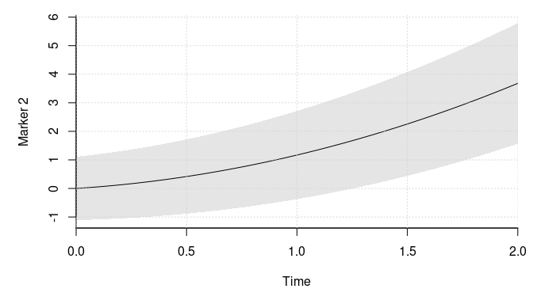<!-- -->

``` r
library(mvtnorm)
# simulates from the model by sampling a given number of individuals
sim_dat <- function(n_ids){
  # simulate the outcomes
  dat <- lapply(1:n_ids, function(id){
    # sample the number of outcomes and the fixed effect covariates
    n_obs <- sample.int(8L, 1L)
    obs_time <- sort(runif(n_obs, 0, 2))
    X1 <- cbind(1, rnorm(n_obs))
    X2 <- matrix(1, n_obs)
    colnames(X1) <- paste0("X1_", 1:NCOL(X1) - 1L)
    colnames(X2) <- paste0("X2_", 1:NCOL(X2) - 1L)
    X <- list(X1, X2)
    
    # sample the outcomes
    U <- drop(rmvnorm(1, sigma = vcov_vary))
    eta <- sapply(1:2, function(i)
      X[[i]] %*% fixef_marker[[i]] + 
      drop(g_funcs[[i]](obs_time)) %*% fixef_vary_marker[[i]] + 
      drop(m_funcs[[i]](obs_time)) %*% U[1:2 + (i == 2) * 2])
    
    ys <- eta + rmvnorm(n_obs, sigma = vcov_marker)
    colnames(ys) <- paste0("Y", 1:2)
    
    # mask some observations
    do_mask <- sample.int(3L, n_obs, replace = TRUE) 
    ys[do_mask == 2, 1] <- NA
    ys[do_mask == 3, 2] <- NA
    
    X <- do.call(cbind, lapply(X, function(x) x[, -1, drop = FALSE]))
    cbind(ys, X, time = obs_time, id = id)
  })
  
  # combine the data and return
  out <- as.data.frame(do.call(rbind, dat))
  out$id <- as.integer(out$id)
  out[sample.int(NROW(out)), ] # the order does not matter
}

# sample a moderately large data set
set.seed(2)
dat <- sim_dat(1000L)

# example of the data for one individual
subset(dat, id == 1)
#>       Y1     Y2     X1_1   time id
#> 3     NA 3.1915  0.13242 1.4047  1
#> 5     NA 4.3373 -0.23970 1.8877  1
#> 4     NA 4.8558  0.70795 1.8869  1
#> 2  1.399 1.7030 -0.08025 1.1467  1
#> 1 -1.286 0.4379 -1.13038 0.3361  1

# estimate the model with this package. Get the object we need for the 
# optimization
marker_1 <- marker_term(
    Y1 ~ X1_1, id = id, subset(dat, !is.na(Y1)), 
    time_fixef = ns_term(time, knots = c(.5, 1.5), Boundary.knots = c(0, 2)),
    time_rng = ns_term(time, knots = numeric(), Boundary.knots = c(0, 2), 
                       intercept = TRUE))
marker_2 <- marker_term(
    Y2 ~ 1, id = id, subset(dat, !is.na(Y2)), 
    time_fixef = poly_term(time, degree = 2, raw = TRUE),
    time_rng = poly_term(time, degree = 1, raw = TRUE, intercept = TRUE))

comp_obj <- joint_ms_ptr(markers = list(marker_1, marker_2), 
                         max_threads = 4L)
rm(marker_1, marker_2)

# get the starting values
system.time(start_val <- joint_ms_start_val(comp_obj))
#>    user  system elapsed 
#>   0.121   0.000   0.032

# lower bound at the starting values
print(-attr(start_val, "value"), digits = 8)
#> [1] -7157.8393

# check that the gradient is correct
f <- function(x){
  start_val[seq_along(x)] <- x
  joint_ms_lb(comp_obj, start_val)
}

all.equal(numDeriv::grad(f, head(start_val, 22 + 2 * 14)), 
          head(joint_ms_lb_gr(comp_obj, start_val), 22 + 2 * 14))
#> [1] TRUE

# find the maximum lower bound estimate
system.time(opt_out <- joint_ms_opt(comp_obj, par = start_val, max_it = 1000L, 
                                    pre_method = 1L, cg_tol = .2, c2 = .1))
#>    user  system elapsed 
#>   1.898   0.000   0.478
opt_out$info # convergence code (0 == 'OK')
#> [1] 0
print(-opt_out$value, digits = 8) # maximum lower bound value
#> [1] -5729.7904

# find the maximum lower bound with lbfgs
library(lbfgsb3c)
system.time(lbfgs_res <- lbfgsb3c(
  start_val, function(x) joint_ms_lb(comp_obj, x),
  function(x) joint_ms_lb_gr(comp_obj, x), 
  control = list(factr = 1e-8, maxit = 10000L)))
#>    user  system elapsed 
#> 103.448   0.015  25.925
lbfgs_res$convergence # convergence code (0 == 'OK')
#> [1] 1
print(-lbfgs_res$value, digits = 8)  # maximum lower bound value
#> [1] -5729.7903
lbfgs_res$counts # may have hit maxit!
#> [1] 10001 10001

# compare the estimates with the actual values. Start with the fixed effects
fmt_ests <- joint_ms_format(comp_obj, opt_out$par)
fmt_ests_lbfgs <- joint_ms_format(comp_obj, lbfgs_res$par)

# the parameters for the first marker
fmt_ests$markers[[1]] 
#> $fixef
#> [1] -0.4966  1.0249
#> 
#> $fixef_vary
#> [1]  1.544 -1.238 -2.114
fmt_ests_lbfgs$markers[[1]] # with lbfgs
#> $fixef
#> [1] -0.4966  1.0249
#> 
#> $fixef_vary
#> [1]  1.544 -1.238 -2.114

fixef_marker[[1]] # true values
#> [1] -0.5  1.0
fixef_vary_marker[[1]] # true values
#> [1]  1.4 -1.2 -2.1

# the parameters for the second marker
fmt_ests$markers[[2]]
#> $fixef
#> [1] 0.2551
#> 
#> $fixef_vary
#> [1] 0.5384 0.6590
fmt_ests_lbfgs$markers[[2]] # with lbfgs
#> $fixef
#> [1] 0.2552
#> 
#> $fixef_vary
#> [1] 0.5382 0.6591
fixef_marker[[2]] # true values
#> [1] 0.25
fixef_vary_marker[[2]] # true values
#> [1] 0.50 0.67

# the parameters for covariance matrix of the random effects
fmt_ests$vcov$vcov_vary
#>            [,1]     [,2]      [,3]      [,4]
#> [1,]  0.4155457  0.02351 -0.006095 0.0004066
#> [2,]  0.0235144  0.19145 -0.087423 0.0167735
#> [3,] -0.0060947 -0.08742  0.331527 0.0689507
#> [4,]  0.0004066  0.01677  0.068951 0.0947936
fmt_ests_lbfgs$vcov$vcov_vary # with lbfgs
#>           [,1]     [,2]      [,3]     [,4]
#> [1,]  0.415549  0.02344 -0.006134 0.000416
#> [2,]  0.023440  0.19170 -0.087525 0.016759
#> [3,] -0.006134 -0.08752  0.331657 0.068841
#> [4,]  0.000416  0.01676  0.068841 0.094881
vcov_vary # the true values
#>       [,1]  [,2]  [,3]  [,4]
#> [1,]  0.35  0.02 -0.05  0.01
#> [2,]  0.02  0.12 -0.06 -0.01
#> [3,] -0.05 -0.06  0.32  0.09
#> [4,]  0.01 -0.01  0.09  0.12

# the parameters for the error term variance
fmt_ests$vcov$vcov_marker
#>        [,1]   [,2]
#> [1,] 0.3575 0.1003
#> [2,] 0.1003 0.1601
fmt_ests_lbfgs$vcov$vcov_marker # with lbfgs
#>        [,1]   [,2]
#> [1,] 0.3575 0.1003
#> [2,] 0.1003 0.1601
vcov_marker
#>      [,1] [,2]
#> [1,] 0.36 0.10
#> [2,] 0.10 0.16
```

### Recurrent Event

We simulate from a model with a recurrent event in this section. This is
a more relevant example as there is not a closed form solution of the
marginal likelihood.

``` r
# the survival parameters
fixef_surv <- c(-.5, .25) # delta
fixef_vary_surv <- c(.5, .1, -.2, .11) # omega
vcov_surv <- matrix(.2^2, 1) # Xi

library(splines)
b_func <- function(x)
  bs(x, knots = 1, Boundary.knots = c(0, 2))

# sample a few survival curves and plot them 
library(SimSurvNMarker)
# time points where we evaluate the conditional survival functions
tis <- seq(0, 2, length.out = 50)
set.seed(1)
# compute the conditional survival functions disregarding the fixed effect
surv_vals <- replicate(100, {
  err <- rnorm(1, sd = sqrt(vcov_surv))
  eval_surv_base_fun(
    ti = tis, omega = fixef_vary_surv, b_func = b_func, 
    gl_dat = get_gl_rule(100), delta = fixef_surv[1] + err)
})

par(mar = c(5, 5, 1, 1))
matplot(tis, surv_vals, type = "l", col = gray(0, .1), bty = "l", lty = 1,
        ylim = c(0, 1), xaxs = "i", yaxs = "i", xlab = "Time", 
        ylab = "Conditional survival function")
```

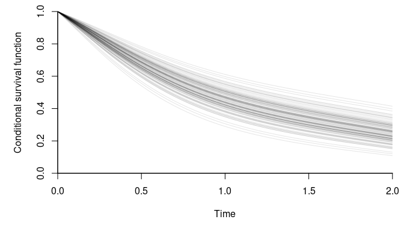<!-- -->

``` r
# compute the average to get an estimate of the marginal survival curve
plot(tis, rowMeans(surv_vals), type = "l",  bty = "l", ylim = c(0, 1), 
     xaxs = "i", yaxs = "i", xlab = "Time", 
     ylab = "Marginal survival function")
```

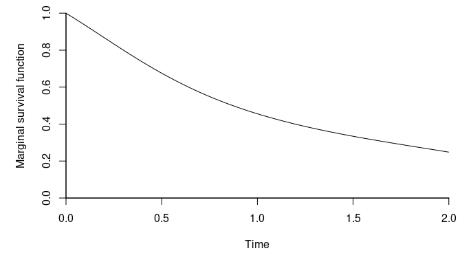<!-- -->

``` r
# simulates from the model by sampling a given number of individuals
sim_dat <- function(n_ids){
  # simulate the outcomes
  gl_dat <- get_gl_rule(100L)
  dat <- lapply(1:n_ids, function(id){
    # simulate the survival outcome
    rng_surv <- rnorm(1, sd = sqrt(vcov_surv))
    Z <- c(1, runif(1, -1, 1))
    log_haz_offset <- sum(Z * fixef_surv) + rng_surv

    # the conditional survival function
    surv_func <- function(ti)
      eval_surv_base_fun(
        ti = ti, omega = fixef_vary_surv, b_func = b_func, gl_dat = gl_dat,
        delta = log_haz_offset)

    # simulate the recurrent events one at a time
    max_sample <- 10L
    Z <- matrix(rep(Z, each = max_sample), max_sample)
    event <- y <- lf_trunc <- rep(NA_real_, max_sample)
    lf_trunc_i <- 0
    rngs <- runif(max_sample)
    left_trunc_surv <- 1
    for(i in 1:max_sample){
      # sample a random uniform variable and invert the survival function
      rng_i <- rngs[i]
      lf_trunc[i] <- lf_trunc_i

      root_func <- function(x) rng_i - surv_func(x) / left_trunc_surv
      if(root_func(2) < 0){
        # the observation is right-censored and we can exit
        y[i] <- 2
        event[i] <- 0
        break
      }

      # we need to invert the survival function to find the observation time
      root <- uniroot(root_func, c(lf_trunc_i, 2), tol = 1e-6)
      lf_trunc_i <- y[i] <- root$root
      event[i] <- 1
      left_trunc_surv <- surv_func(y[i])
    }

    # keep the needed data and return
    colnames(Z) <- paste0("Z_", 1:NCOL(Z) - 1L)
    surv_data <- cbind(lf_trunc = lf_trunc[1:i], y = y[1:i], event = event[1:i],
                       Z[1:i, -1, drop = FALSE], id = id)

    list(surv_data = surv_data)
  })

  # combine the data and return
  surv_data <- as.data.frame(do.call(
    rbind, lapply(dat, `[[`, "surv_data")))
  surv_data$id <- as.integer(surv_data$id)
  # the order does not matter
  surv_data <- surv_data[sample.int(NROW(surv_data)), ]

  list(surv_data = surv_data)
}

# sample a moderately large data set
set.seed(3)
dat <- sim_dat(1000L)

# we show a few properties of the data below
NROW(dat$surv_data) # number of survival outcomes
#> [1] 2388
sum(dat$surv_data$event) # number of observed events
#> [1] 1388

# example of the data for three individuals
subset(dat$surv_data, id %in% 1:3)
#>   lf_trunc      y event     Z_1 id
#> 5   1.6383 2.0000     0  0.1208  3
#> 3   0.0000 0.3526     1  0.1208  3
#> 4   0.3526 1.6383     1  0.1208  3
#> 1   0.0000 2.0000     0 -0.2301  1
#> 2   0.0000 2.0000     0  0.6594  2

# distribution of observed events per individual
proportions(table(table(dat$surv_data$id) - 1L))
#> 
#>     0     1     2     3     4     5     6 
#> 0.266 0.343 0.220 0.103 0.050 0.012 0.006

# estimate the model with this package. Get the object we need for the
# optimization
library(survival)
library(VAJointSurv)
surv_obj <- surv_term(
  Surv(lf_trunc, y, event) ~ Z_1, id = id, dat$surv_data,
  time_fixef = bs_term(y, knots = 1, Boundary.knots = c(0, 2)))

comp_obj <- joint_ms_ptr(markers = list(),
                         survival_terms = surv_obj, max_threads = 4L)
rm(surv_obj)

# get the starting values
system.time(start_val <- joint_ms_start_val(comp_obj))
#>    user  system elapsed 
#>   0.079   0.000   0.023

# lower bound at the starting values
print(-attr(start_val, "value"), digits = 8)
#> [1] -1864.1515

# check that the gradient is correct
f <- function(x){
  start_val <- comp_obj$start_val
  start_val[seq_along(x)] <- x
  joint_ms_lb(comp_obj, start_val)
}

all.equal(numDeriv::grad(f, head(comp_obj$start_val, 7 + 2 * 2)), 
          head(joint_ms_lb_gr(comp_obj, comp_obj$start_val), 7 + 2 * 2), 
          tolerance = 1e-6)
#> [1] TRUE

# find the maximum lower bound estimate
system.time(opt_out <- joint_ms_opt(comp_obj, par = start_val, max_it = 1000L, 
                                    pre_method = 1L, cg_tol = .2, c2 = .1))
#>    user  system elapsed 
#>   1.563   0.000   0.393
opt_out$info # convergence code (0 == 'OK')
#> [1] 0
print(-opt_out$value, digits = 8) # maximum lower bound value
#> [1] -1863.2793

# check the estimates
fmt_est <- joint_ms_format(comp_obj, opt_out$par)

rbind(estimate = fmt_est$survival[[1]]$fixef, truth = fixef_surv)
#>             [,1]   [,2]
#> estimate -0.5075 0.2583
#> truth    -0.5000 0.2500
rbind(estimate = fmt_est$survival[[1]]$fixef_vary, truth = fixef_vary_surv)
#>            [,1]   [,2]    [,3]    [,4]
#> estimate 0.3981 0.2571 -0.3212 0.07987
#> truth    0.5000 0.1000 -0.2000 0.11000
c(estimate = sqrt(fmt_est$vcov$vcov_surv), truth = sqrt(vcov_surv))
#> estimate    truth 
#>   0.2285   0.2000
```

#### Note on Quadrature Rule

A quadrature rule is used to integrate the expected cumulative hazard.
The user can pass any quadrature rule with
 nodes
and weights each denoted by ") such that

  
 dx \\approx \\sum_{i = 1}^nw_i f(n_i).")  

By default Gauss–Legendre quadrature is used. A very simple alternative
is to use the midpoint rule. This is illustrated below.

``` r
# computes the midpoint rule
mid_rule <- function(n)
  list(node = seq(0, 1, length.out = n), weight = rep(1 / n, n))

# compare the midpoint with different number of nodes
for(n in 2^(3:12)){
  res <- joint_ms_lb(comp_obj, opt_out$par, n_threads = 4L, 
                     quad_rule = mid_rule(n))
  cat(sprintf("# nodes, lower bound  %5d %12.4f\n", n, res))
}
#> # nodes, lower bound      8    1859.7688
#> # nodes, lower bound     16    1861.4885
#> # nodes, lower bound     32    1862.3715
#> # nodes, lower bound     64    1862.8221
#> # nodes, lower bound    128    1863.0499
#> # nodes, lower bound    256    1863.1643
#> # nodes, lower bound    512    1863.2217
#> # nodes, lower bound   1024    1863.2504
#> # nodes, lower bound   2048    1863.2648
#> # nodes, lower bound   4096    1863.2720

# the maximum lower bound value we got with Gauss–Legendre quadrature
print(-opt_out$value, digits = 8)
#> [1] -1863.2793
```

We can compare this with using Gauss–Legendre quadrature with different
number of nodes.

``` r
# get the rules
library(gaussquad)
#> Loading required package: polynom
#> Loading required package: orthopolynom
rules <- legendre.quadrature.rules(2^8, normalized = TRUE)

# rescale the rule
rules <- lapply(rules, function(x)
  list(node = .5 * (x[, "x"] + 1), weight = .5 * x[, "w"]))

# use different number of nodes
for(n in 2^(2:8)){
  res <- joint_ms_lb(comp_obj, opt_out$par, n_threads = 4L, 
                     quad_rule = rules[[n]])
  cat(sprintf("# nodes, lower bound  %5d %12.8f\n", n, res))
}
#> # nodes, lower bound      4 1863.11282879
#> # nodes, lower bound      8 1863.26663158
#> # nodes, lower bound     16 1863.27841006
#> # nodes, lower bound     32 1863.27912599
#> # nodes, lower bound     64 1863.27917307
#> # nodes, lower bound    128 1863.27917606
#> # nodes, lower bound    256 1863.27917625

# the result we got
print(-opt_out$value, digits = 14)
#> [1] -1863.2793280361
length(comp_obj$quad_rule$node) # the number of nodes we used
#> [1] 25
```

Evaluating the approximate expected cumulative hazard is by far the most
computationally expensive part of the likelihood. Therefore, it may be
nice to use fewer nodes e.g. when finding starting values.

### Two Markers and a Recurrent Event

We simulate from a model with two different types of markers and a
recurrent event in this section.

A Weibull model is selected for the baseline hazard by taking a
polynomial of degree one and using the log of time. As an illustration,
we select a more flexible expansion in the baseline hazard in the model
we estimate.

``` r
# settings for the simulation
library(splines)
g_funcs <- list(
  function(x)
    ns(x, knots = c(.5, 1.5), Boundary.knots = c(0, 2)),
  function(x)
    # a raw polynomial
    outer(x, 1:2, `^`))
m_funcs <- list(
  function(x)
    ns(x, knots = numeric(), Boundary.knots = c(0, 2), intercept = TRUE), 
  function(x)
    # a raw polynomial
    outer(x, 0:1, `^`))

fixef_vary_marker <- list(c(1.4, -1.2, -2.1), c(.5, .67)) # beta
fixef_marker <- list(c(-.5, 1), .25) # gamma

# Psi
vcov_vary <- structure(
  c(0.35, 0.02, -0.05, 0.01, 0.02, 0.12, -0.06, -0.01, -0.05, -0.06, 0.32, 0.09, 0.01, -0.01, 0.09, 0.12),
  .Dim = c(4L, 4L))
vcov_marker <- matrix(c(.6^2, .1, .1, .4^2), 2) # Sigma

# plot the markers' mean curve
library(VAJointSurv)
par(mar = c(5, 5, 1, 1))
plot_marker(
  time_fixef = ns_term(
    knots = c(.5, 1.5), Boundary.knots = c(0, 2)),
  time_rng = ns_term(
    knots = numeric(), Boundary.knots = c(0, 2), intercept = TRUE), 
  fixef_vary = fixef_vary_marker[[1]], x_range = c(0, 2), 
  vcov_vary = vcov_vary[1:2, 1:2], ylab = "Marker 1")
```

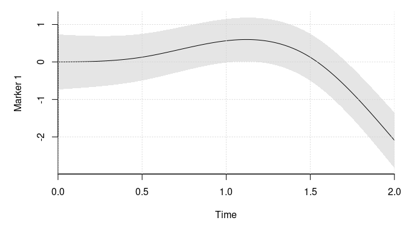<!-- -->

``` r
plot_marker(
  time_fixef = poly_term(degree = 2, raw = TRUE),
  time_rng = poly_term(degree = 1, raw = TRUE, intercept = TRUE), 
  fixef_vary = fixef_vary_marker[[2]], x_range = c(0, 2), 
  vcov_vary = vcov_vary[3:4, 3:4], ylab = "Marker 2")
```

<!-- -->

``` r
# the survival parameters
fixef_surv <- c(-.5, .25) # delta
associations <- c(-.8, .7) # alpha
fixef_vary_surv <- c(.5) # omega
vcov_surv <- matrix(.2^2, 1) # Xi

b_term <- poly_term(degree = 1L, use_log = TRUE, raw = TRUE)
b_func <- function(x)
  t(b_term$eval(x))

# plot the hazard with pointwise quantiles
plot_surv(
  time_fixef = b_term, 
  time_rng = list(
    ns_term(knots = numeric(), Boundary.knots = c(0, 2), intercept = TRUE), 
    poly_term(degree = 1, raw = TRUE, intercept = TRUE)), 
  x_range = c(0, 2), vcov_vary = vcov_vary, frailty_var = vcov_surv,
  ps = c(.25, .5, .75), log_hazard_shift = fixef_surv[1], 
  fixef_vary = fixef_vary_surv, associations = associations)
```

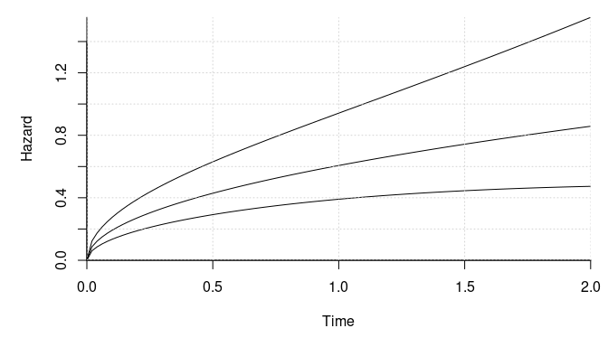<!-- -->

``` r
# without the markers
plot_surv(
  time_fixef = b_term, 
  time_rng = list(
    ns_term(knots = numeric(), Boundary.knots = c(0, 2), intercept = TRUE), 
    poly_term(degree = 1, raw = TRUE, intercept = TRUE)), 
  x_range = c(0, 2), vcov_vary = matrix(0, 4, 4), frailty_var = vcov_surv,
  ps = c(.25, .5, .75), log_hazard_shift = fixef_surv[1], 
  fixef_vary = fixef_vary_surv, associations = associations)
```

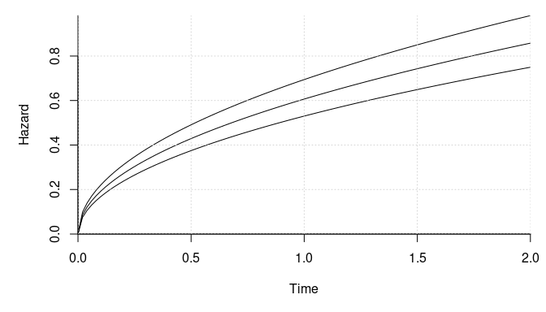<!-- -->

``` r
# compute a few survival curves and plot them 
library(SimSurvNMarker)
 # time points where we evaluate the conditional survival functions
tis <- seq(0, 2, length.out = 50)
set.seed(1)
Us <- mvtnorm::rmvnorm(250, sigma = vcov_vary) # the random effects
# compute the conditional survival functions disregarding the fixed effect
surv_vals <- apply(Us, 1, function(U){
  expansion <- function(x)
    cbind(b_func(x), m_funcs[[1]](x) %*% U[1:2], 
          m_funcs[[2]](x) %*% U[3:4])
  
  err <- rnorm(1, sd = sqrt(vcov_surv))
  
  eval_surv_base_fun(
    ti = tis, omega = c(fixef_vary_surv, associations), b_func = expansion, 
    gl_dat = get_gl_rule(100), delta = fixef_surv[1] + err)
})

matplot(tis, surv_vals, type = "l", col = gray(0, .1), bty = "l", lty = 1,
        ylim = c(0, 1), xaxs = "i", yaxs = "i", xlab = "Time", 
        ylab = "Conditional survival function")
```

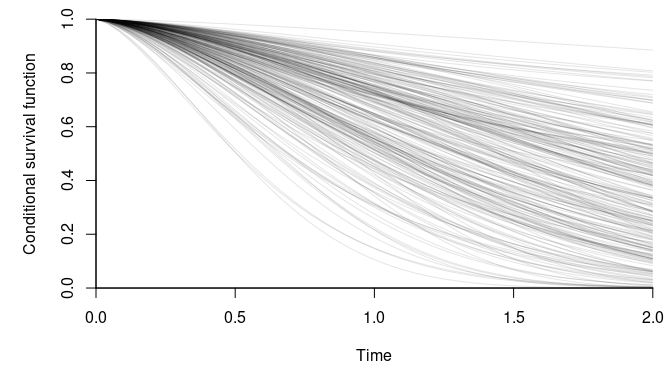<!-- -->

``` r
# compute the average to get an estimate of the marginal survival curve
plot(tis, rowMeans(surv_vals), type = "l",  bty = "l", ylim = c(0, 1), 
     xaxs = "i", yaxs = "i", xlab = "Time", 
     ylab = "Marginal survival function")
```

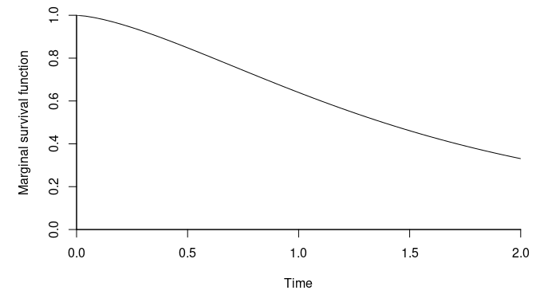<!-- -->

``` r
library(mvtnorm)
# simulates from the model by sampling a given number of individuals
sim_dat <- function(n_ids){
  # simulate the outcomes
  gl_dat <- get_gl_rule(100L)
  dat <- lapply(1:n_ids, function(id){
    # sample the number of outcomes and the fixed effect covariates
    n_obs <- sample.int(8L, 1L)
    obs_time <- sort(runif(n_obs, 0, 2))
    X1 <- cbind(1, rnorm(n_obs))
    X2 <- matrix(1, n_obs)
    colnames(X1) <- paste0("X1_", 1:NCOL(X1) - 1L)
    colnames(X2) <- paste0("X2_", 1:NCOL(X2) - 1L)
    X <- list(X1, X2)

    # sample the outcomes
    U <- drop(rmvnorm(1, sigma = vcov_vary))
    eta <- sapply(1:2, function(i)
      X[[i]] %*% fixef_marker[[i]] +
      drop(g_funcs[[i]](obs_time)) %*% fixef_vary_marker[[i]] +
      drop(m_funcs[[i]](obs_time)) %*% U[1:2 + (i == 2) * 2])

    ys <- eta + rmvnorm(n_obs, sigma = vcov_marker)
    colnames(ys) <- paste0("Y", 1:2)

    # mask some observations
    do_mask <- sample.int(3L, n_obs, replace = TRUE)
    ys[do_mask == 2, 1] <- NA
    ys[do_mask == 3, 2] <- NA

    X <- do.call(cbind, lapply(X, function(x) x[, -1, drop = FALSE]))
    marker_data <- cbind(ys, X, time = obs_time, id = id)
    
    # clean up 
    rm(list = setdiff(ls(), c("U", "marker_data", "id")))

    # simulate the survival outcome
    rng_surv <- rnorm(1, sd = sqrt(vcov_surv))
    Z <- c(1, runif(1, -1, 1))
    log_haz_offset <- sum(Z * fixef_surv) + rng_surv

    expansion <- function(x)
      cbind(b_func(x), m_funcs[[1]](x) %*% U[1:2],
            m_funcs[[2]](x) %*% U[3:4])

    # the conditional survival function
    surv_func <- function(ti)
      eval_surv_base_fun(
        ti = ti, omega = c(fixef_vary_surv, associations), b_func = expansion,
        gl_dat = gl_dat, delta = log_haz_offset)

    # simulate the recurrent events one at a time
    max_sample <- 10L
    Z <- matrix(rep(Z, each = max_sample), max_sample)
    event <- y <- lf_trunc <- rep(NA_real_, max_sample)
    lf_trunc_i <- 0
    left_trunc_surv <- 1
    for(i in 1:max_sample){
      # sample a random uniform variable and invert the survival function
      rng_i <- runif(1)
      lf_trunc[i] <- lf_trunc_i

      root_func <- function(x) rng_i - surv_func(x) / left_trunc_surv
      if(root_func(2) < 0){
        # the observation is right-censored and we can exit
        y[i] <- 2
        event[i] <- 0
        break
      }

      # we need to invert the survival function to find the observation time
      root <- uniroot(root_func, c(lf_trunc_i, 2), tol = 1e-6)
      lf_trunc_i <- y[i] <- root$root
      event[i] <- 1
      left_trunc_surv <- surv_func(y[i])
    }

    # keep the needed data and return
    colnames(Z) <- paste0("Z_", 1:NCOL(Z) - 1L)

    surv_data <- cbind(lf_trunc = lf_trunc[1:i], y = y[1:i], event = event[1:i],
                       Z[1:i, -1, drop = FALSE], id = id)

    list(marker_data = marker_data, surv_data = surv_data)
  })

  # combine the data and return
  marker_data <- as.data.frame(do.call(
    rbind, lapply(dat, `[[`, "marker_data")))
  marker_data$id <- as.integer(marker_data$id)
  # the order does not matter
  marker_data <- marker_data[sample.int(NROW(marker_data)), ]

  surv_data <- as.data.frame(do.call(
    rbind, lapply(dat, `[[`, "surv_data")))
  surv_data$id <- as.integer(surv_data$id)
  # the order does not matter
  surv_data <- surv_data[sample.int(NROW(surv_data)), ]

  list(marker_data = marker_data, surv_data = surv_data)
}

# sample a moderately large data set
set.seed(2)
dat <- sim_dat(1000L)

# we show a few properties of the data below
NROW(dat$marker_data) # number of observed marker
#> [1] 4463
NROW(dat$surv_data) # number of survival outcomes
#> [1] 2495
sum(dat$surv_data$event) # number of observed events
#> [1] 1500

# the data for one individual
subset(dat$marker_data, id == 1)
#>       Y1     Y2     X1_1   time id
#> 5     NA 4.3373 -0.23970 1.8877  1
#> 4     NA 4.8558  0.70795 1.8869  1
#> 3     NA 3.1915  0.13242 1.4047  1
#> 2  1.399 1.7030 -0.08025 1.1467  1
#> 1 -1.286 0.4379 -1.13038 0.3361  1
subset(dat$surv_data, id == 1)
#>   lf_trunc     y event     Z_1 id
#> 2    1.091 1.205     1 -0.9706  1
#> 3    1.205 2.000     0 -0.9706  1
#> 1    0.000 1.091     1 -0.9706  1

# distribution of observed events per individual
proportions(table(table(dat$surv_data$id) - 1L))
#> 
#>     0     1     2     3     4     5     6     7     8     9 
#> 0.320 0.320 0.154 0.090 0.057 0.031 0.008 0.005 0.004 0.011

# estimate the model with this package. Get the object we need for the
# optimization
marker_1 <- marker_term(
    Y1 ~ X1_1, id = id, subset(dat$marker_data, !is.na(Y1)),
    time_fixef = ns_term(time, knots = c(.5, 1.5), Boundary.knots = c(0, 2)),
    time_rng = ns_term(time, knots = numeric(), Boundary.knots = c(0, 2),
                       intercept = TRUE))
marker_2 <- marker_term(
    Y2 ~ 1, id = id, subset(dat$marker_data, !is.na(Y2)),
    time_fixef = poly_term(time, degree = 2, raw = TRUE),
    time_rng = poly_term(time, degree = 1, raw = TRUE, intercept = TRUE))

surv_obj <- surv_term(
  Surv(lf_trunc, y, event) ~ Z_1, id = id, dat$surv_data,
  # we select a more flexible model for the baseline hazard
  time_fixef = poly_term(y, degree = 3L, raw = TRUE, use_log = TRUE))

comp_obj <- joint_ms_ptr(markers = list(marker_1, marker_2),
                         survival_terms = surv_obj, max_threads = 4L)
rm(marker_1, marker_2, surv_obj)

# get the starting values
system.time(start_val <- joint_ms_start_val(comp_obj))
#>    user  system elapsed 
#>   2.418   0.000   0.632

# lower bound at the starting values
print(-attr(start_val, "value"), digits = 8)
#> [1] -7542.5637

# check that the gradient is correct
f <- function(x){
  start_val[seq_along(x)] <- x
  joint_ms_lb(comp_obj, start_val)
}

all.equal(numDeriv::grad(f, head(start_val, 29 + 2 * 20)), 
          head(joint_ms_lb_gr(comp_obj, start_val), 29 + 2 * 20))
#> [1] "Mean relative difference: 7.058e-08"

# find the maximum lower bound estimate
system.time(opt_out <- joint_ms_opt(comp_obj, par = start_val, max_it = 1000L, 
                                    pre_method = 1L, cg_tol = .2, c2 = .1))
#>    user  system elapsed 
#>  15.687   0.008   3.925
opt_out$info # convergence code (0 == 'OK')
#> [1] 0
print(-opt_out$value, digits = 8) # maximum lower bound value
#> [1] -7257.022

# find the maximum lower bound with lbfgs
library(lbfgsb3c)
system.time(lbfgs_res <- lbfgsb3c(
  start_val, function(x) joint_ms_lb(comp_obj, x),
  function(x) joint_ms_lb_gr(comp_obj, x), 
  control = list(factr = 1e-8, maxit = 2000L)))
#>    user  system elapsed 
#>  74.366   0.008  18.596
lbfgs_res$convergence # convergence code (0 == 'OK')
#> [1] 1
print(-lbfgs_res$value, digits = 8)  # maximum lower bound value
#> [1] -7257.4159
lbfgs_res$counts # may have hit maxit!
#> [1] 2000 2000

# compare the estimates with the actual values. Start with the fixed effects
fmt_ests <- joint_ms_format(comp_obj, opt_out$par)

# the parameters for the first marker
fmt_ests$markers[[1]] 
#> $fixef
#> [1] -0.4924  1.0171
#> 
#> $fixef_vary
#> [1]  1.403 -1.190 -2.031

fixef_marker[[1]] # true values
#> [1] -0.5  1.0
fixef_vary_marker[[1]] # true values
#> [1]  1.4 -1.2 -2.1

# the parameters for the second marker
fmt_ests$markers[[2]]
#> $fixef
#> [1] 0.2441
#> 
#> $fixef_vary
#> [1] 0.6130 0.6281
fixef_marker[[2]] # true values
#> [1] 0.25
fixef_vary_marker[[2]] # true values
#> [1] 0.50 0.67

# the fixed effects for the survival outcome and the association parameters
fmt_ests$survival[[1]]
#> $fixef
#> [1] -0.5066  0.2612
#> 
#> $fixef_vary
#> [1] 0.40358 0.07527 0.03279
#> 
#> $associations
#> [1] -0.7313  0.7050
fixef_surv
#> [1] -0.50  0.25
fixef_vary_surv
#> [1] 0.5
associations
#> [1] -0.8  0.7

# the parameters for covariance matrix of the random effects
fmt_ests$vcov$vcov_vary
#>           [,1]      [,2]     [,3]      [,4]
#> [1,]  0.316746  0.008737 -0.04182  0.012385
#> [2,]  0.008737  0.167255 -0.05185 -0.004203
#> [3,] -0.041825 -0.051852  0.30519  0.090854
#> [4,]  0.012385 -0.004203  0.09085  0.139242
vcov_vary # the true values
#>       [,1]  [,2]  [,3]  [,4]
#> [1,]  0.35  0.02 -0.05  0.01
#> [2,]  0.02  0.12 -0.06 -0.01
#> [3,] -0.05 -0.06  0.32  0.09
#> [4,]  0.01 -0.01  0.09  0.12

# the parameters for the error term covariance matrix
fmt_ests$vcov$vcov_marker
#>         [,1]    [,2]
#> [1,] 0.37499 0.09842
#> [2,] 0.09842 0.16335
vcov_marker
#>      [,1] [,2]
#> [1,] 0.36 0.10
#> [2,] 0.10 0.16

# the parameters for the frailty covariance matrix
fmt_ests$vcov$vcov_surv
#>         [,1]
#> [1,] 0.03716
vcov_surv
#>      [,1]
#> [1,] 0.04
```

#### Approximate Likelihood Ratio based Confidence Intervals

Assuming that the lower bound is tight, we can construct approximate
likelihood ratio based confidence intervals using the lower bound. We
show how to do this below with the `mask` argument of `joint_ms_opt`.

``` r
# fixed input 
level <- .95 # confidence level
which_fix <- 14L
# see the indices element for which element is fixed. It is an association 
# parameter in this case
comp_obj$indices$survival[[1]]$associations # confidence interval for 
#> [1] 14 15

# assumed plausible values of the parameter. The joint_ms_profile function
# shown later finds these automatically
params <- opt_out$par[which_fix]
params <- seq(params - .5, params + .5, length.out = 15)

# find the maximum lower bound values
lbs_max <- sapply(params, function(x){
  par <- opt_out$par
  par[which_fix] <- x
  res <- joint_ms_opt(comp_obj, par = par, max_it = 1000L, 
                      pre_method = 1L, cg_tol = .2, c2 = .1, 
                      # -1 needed in the psqn package (zero-based indices)
                      mask = which_fix - 1L)
  
  # return the maximum lower bound if the method converged
  if(!res$convergence)
    stop("did not converge")
  -res$value
})
```

``` r
# find the critical value and the approximate confidence interval
z_vals <- sqrt(pmax(-opt_out$value - lbs_max, 0) * 2)
z_vals <- ifelse(params < opt_out$par[which_fix], -1, 1) * z_vals

alpha <- 1 - level
pvs <- c(alpha / 2, 1 - alpha/2)
conf_int <- setNames(approx(z_vals, params, xout = qnorm(pvs))$y,
                     sprintf("%.2f pct.", 100 * pvs))
conf_int # the approximate confidence interval
#>  2.50 pct. 97.50 pct. 
#>    -1.0786    -0.4066

# plot the approximate log profile likelihood and highlight the critical value
par(mar = c(5, 5, 1, 1))
plot(params, lbs_max, pch = 16, bty = "l", xlab = "Association parameter", 
     ylab = "Approximate log profile likelihood")
grid()
smooth_est <- smooth.spline(params, lbs_max)
lines(predict(smooth_est, seq(min(params), max(params), length.out = 100)))

# mark the confidence interval
abline(h = -opt_out$value - qchisq(level, 1) / 2, lty = 2)
abline(v = conf_int, lty = 2)
```

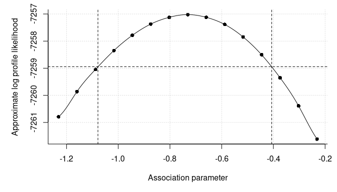<!-- -->

The `joint_ms_profile` uses similar steps to the above to find
approximate profile likelihood based confidence intervals. An example is
shown below.

``` r
# construct the approximate likelihood ratio based confidence interval
prof_conf <- joint_ms_profile(
  comp_obj, opt_out = opt_out, which_prof = which_fix, delta = .25, 
  level = level, 
  max_it = 1000L, pre_method = 1L, cg_tol = .2, c2 = .1)
#> 
#> Finding the upper limit of the approximate profile likelihood curve
#> LogLike: -7258.1512 at        -0.481341
#> LogLike: -7261.6067 at        -0.231341
#> LogLike: -7259.3845 at        -0.371687. Lb, target, ub: -7259.3845, -7258.9427, -7258.1512
#> LogLike: -7258.8944 at        -0.410731. Lb, target, ub: -7259.3845, -7258.9427, -7258.8944
#> 
#> Finding the lower limit of the approximate profile likelihood curve
#> LogLike: -7258.0511 at        -0.981341
#> LogLike: -7260.7881 at        -1.231341
#> LogLike: -7259.3136 at        -1.108738. Lb, target, ub: -7259.3136, -7258.9427, -7258.0511
#> LogLike: -7258.8542 at        -1.067635. Lb, target, ub: -7259.3136, -7258.9427, -7258.8542
#> LogLike: -7257.0220 at        -0.731341
```

``` r
prof_conf$confs # the approximate confidence interval
#>  2.50 pct. 97.50 pct. 
#>    -1.0759    -0.4067

# plot the approximate log profile likelihood and highlight the critical value
par(mar = c(5, 5, 1, 1))

with(prof_conf, {
  plot(xs, p_log_Lik, pch = 16, bty = "l", 
     xlab = "Association parameter", ylab = "Approximate log profile likelihood")
  grid()
  smooth_est <- smooth.spline(xs, p_log_Lik)
  lines(predict(smooth_est, seq(min(xs), max(xs), length.out = 100)))
  
  abline(v = confs, lty = 2)
})
```

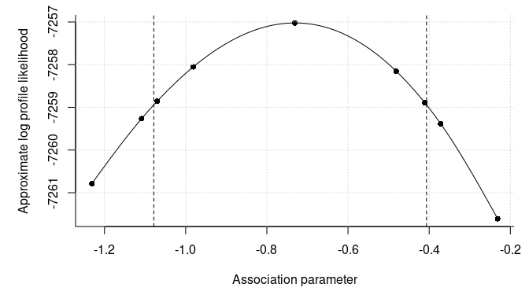<!-- -->

### Two Markers, the Observation Time Process, and a Terminal Event

We simulate and fit a model in this section where we have two markers, a
recurrent event which is the observation times, and a terminal event.

``` r
# settings for the simulation
library(splines)
g_funcs <- list(
  function(x)
    ns(x, knots = c(3.33, 6.67), Boundary.knots = c(0, 10)),
  function(x)
    # a raw polynomial
    outer(x, 1:2, `^`))
m_funcs <- list(
  function(x)
    ns(x, knots = numeric(), Boundary.knots = c(0, 10), intercept = TRUE),
  function(x)
    # a raw polynomial
    outer(x, 0:1, `^`))

fixef_vary_marker <- list(c(1.4, 1.2, -2.1), c(.5, -.02)) # beta
fixef_marker <- list(c(-.5, 2), 1) # gamma

# Psi
vcov_vary <- structure(c(0.35, 0.08, -0.05, 0.01, 0.08, 1.92, -0.24, -0.04,
                   -0.05, -0.24, 0.32, 0.09, 0.01, -0.04, 0.09, 0.12),
                 .Dim = c(4L, 4L))
vcov_marker <- matrix(c(.6^2, .1, .1, .4^2), 2)

# plot the markers' mean curve
library(VAJointSurv)
par(mar = c(5, 5, 1, 1))
plot_marker(
  time_fixef = ns_term(
    knots = c(3.33, 6.67), Boundary.knots = c(0, 10), intercept = FALSE),
  time_rng = ns_term(
    knots = numeric(), Boundary.knots = c(0, 10), intercept = TRUE),
  fixef_vary = fixef_vary_marker[[1]], x_range = c(0, 10),
  vcov_vary = vcov_vary[1:2, 1:2], ylab = "Marker 1")
```

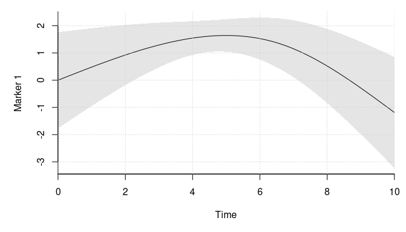<!-- -->

``` r
plot_marker(
  time_fixef = poly_term(degree = 2, raw = TRUE),
  time_rng = poly_term(degree = 1, raw = TRUE, intercept = TRUE),
  fixef_vary = fixef_vary_marker[[2]], x_range = c(0, 10),
  vcov_vary = vcov_vary[3:4, 3:4], ylab = "Marker 2")
```

<!-- -->

``` r
# the survival parameters
vcov_surv <- matrix(c(.2^2, .15^2, .15^2, .25^2), 2) # Xi 

fixef_surv <- list(c(-1, .25), .2)
associations <- list(c(.6, -.4), c(-.7, .2))
fixef_vary_surv <- list(c(.5, .1, -.2, .11),
                          c(-1, -.25))

b_funcs <- list(
  function(x) bs(x, knots = 5, Boundary.knots = c(0, 10)),
  function(x) ns(x, knots = 5, Boundary.knots = c(0, 10)))

# plot the log hazard with the 25%, 50% and 75% quantiles
library(SimSurvNMarker)

plot_surv(
  time_fixef = bs_term(knots = 5, Boundary.knots = c(0, 10)),
  time_rng = list(
    ns_term(knots = numeric(), Boundary.knots = c(0, 10), intercept = TRUE),
    poly_term(degree = 1, raw = TRUE, intercept = TRUE)),
  x_range = c(0, 10), fixef_vary = fixef_vary_surv[[1]],
  vcov_vary = vcov_vary, frailty_var = vcov_surv[1, 1], ps = c(.25, .5, .75),
  associations = associations[[1]], log_hazard_shift = fixef_surv[[1]][1],
  ylab = "Terminal event")
```

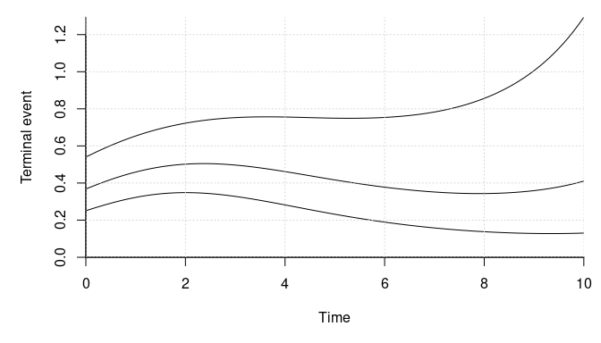<!-- -->

``` r
plot_surv(
  time_fixef = ns_term(knots = 5, Boundary.knots = c(0, 10)),
  time_rng = list(
    ns_term(knots = numeric(), Boundary.knots = c(0, 10), intercept = TRUE),
    poly_term(degree = 1, raw = TRUE, intercept = TRUE)),
  x_range = c(0, 10), fixef_vary = fixef_vary_surv[[2]],
  vcov_vary = vcov_vary, frailty_var = vcov_surv[2, 2], ps = c(.25, .5, .75),
  associations = associations[[2]], log_hazard_shift = fixef_surv[[2]][1],
  ylab = "Observation process")
```

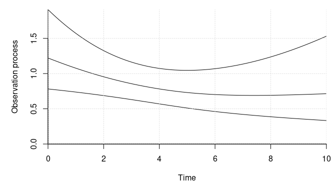<!-- -->

``` r
library(mvtnorm)
# simulates from the model by sampling a given number of individuals
sim_dat <- function(n_ids){
  # simulate the outcomes
  gl_dat <- get_gl_rule(100L)
  dat <- lapply(1:n_ids, function(id){
    # sample the terminal event time and the censoring time
    cens <- min(rexp(1, rate = 1/10), 10)
    U <- drop(rmvnorm(1, sigma = vcov_vary))

    frailties <- drop(rmvnorm(1, sigma = vcov_surv))
    Z1 <- c(1, runif(1, -1, 1))
    log_haz_offset <- sum(Z1 * fixef_surv[[1]]) + frailties[1]

    # assign the conditional hazard function
    expansion <- function(x, b_func)
      cbind(b_func(x), m_funcs[[1]](x) %*% U[1:2],
            m_funcs[[2]](x) %*% U[3:4])
    surv_func <- function(ti, fixef_vary_surv, associations, b_func){
      formals(expansion)$b_func <- b_func
      eval_surv_base_fun(
        ti = ti, omega = c(fixef_vary_surv, associations), b_func = expansion,
        gl_dat = gl_dat, delta = log_haz_offset)
    }

    # sample the survival time
    rng <- runif(1)
    root_func <- function(x, rng)
      rng - surv_func(x, fixef_vary_surv = fixef_vary_surv[[1]],
                      associations = associations[[1]], b_func = b_funcs[[1]])

    if(root_func(cens, rng) < 0){
      # the observation is censored
      y_terminal <- cens
      event <- 0
    } else {
      # find the event time
      root <- uniroot(root_func, c(0, cens), tol = 1e-6, rng = rng)
      y_terminal <- root$root
      event <- 1

    }

    terminal_outcome <- cbind(y = y_terminal, event = event, Z1 = Z1[2],
                              id = id)

    # clean up
    rm(list = setdiff(ls(), c("y_terminal", "terminal_outcome", "expansion",
                              "surv_func", "frailties", "U", "id")))

    # simulate the observation times
    Z2 <- 1
    log_haz_offset <- sum(Z2 * fixef_surv[[2]]) + frailties[2]

    root_func <- function(x, left_trunc_surv, rng)
      rng - surv_func(x, fixef_vary_surv = fixef_vary_surv[[2]],
                      associations = associations[[2]], b_func = b_funcs[[2]]) /
      left_trunc_surv

    max_sample <- 1000L
    left_trunc_surv <- 1
    Z2 <- matrix(rep(Z2, each = max_sample), max_sample)
    event <- y <- lf_trunc <- rep(NA_real_, max_sample)
    lf_trunc_i <- 0
    for(i in 1:max_sample){
      # sample a random uniform variable and invert the survival function
      rng_i <- runif(1)
      lf_trunc[i] <- lf_trunc_i

      if(root_func(y_terminal, left_trunc_surv, rng_i) < 0){
        # the observation is right-censored and we can exit
        y[i] <- y_terminal
        event[i] <- 0
        break
      }

      # we need to invert the survival function to find the observation time
      root <- uniroot(root_func, c(lf_trunc_i, y_terminal), tol = 1e-6,
                      left_trunc_surv = left_trunc_surv, rng = rng_i)
      lf_trunc_i <- y[i] <- root$root
      event[i] <- 1
      left_trunc_surv <- surv_func(
        y[i], fixef_vary_surv = fixef_vary_surv[[2]], associations = associations[[2]],
        b_func = b_funcs[[2]])
    }

    colnames(Z2) <- paste0("Z", 1:NCOL(Z2) - 1L)
    obs_process <- cbind(lf_trunc = lf_trunc[1:i], y = y[1:i],
                         event = event[1:i], Z2[1:i, -1, drop = FALSE],
                         id = id)

    # clean up
    rm(list = setdiff(ls(), c("terminal_outcome", "U", "id",
                              "obs_process")))

    # sample the number of outcomes and the fixed effect covariates
    obs_time <- c(0, obs_process[obs_process[, "event"] == 1, "y"])
    n_obs <- length(obs_time)
    X1 <- cbind(1, rnorm(n_obs))
    X2 <- matrix(1, n_obs)
    colnames(X1) <- paste0("X1_", 1:NCOL(X1) - 1L)
    colnames(X2) <- paste0("X2_", 1:NCOL(X2) - 1L)
    X <- list(X1, X2)

    # sample the outcomes
    eta <- sapply(1:2, function(i)
      X[[i]] %*% fixef_marker[[i]] +
        drop(g_funcs[[i]](obs_time)) %*% fixef_vary_marker[[i]] +
        drop(m_funcs[[i]](obs_time)) %*% U[1:2 + (i == 2) * 2])

    ys <- eta + rmvnorm(n_obs, sigma = vcov_marker)
    colnames(ys) <- paste0("Y", 1:2)

    # mask some observations
    do_mask <- sample.int(3L, n_obs, replace = TRUE)
    ys[do_mask == 2, 1] <- NA
    ys[do_mask == 3, 2] <- NA

    X <- do.call(cbind, lapply(X, function(x) x[, -1, drop = FALSE]))
    marker_data <- cbind(ys, X, time = obs_time, id = id)

    return(list(marker_data = marker_data, obs_process = obs_process,
                terminal_outcome = terminal_outcome))
  })

  # combine the data and return
  marker_data <- as.data.frame(do.call(
    rbind, lapply(dat, `[[`, "marker_data")))
  marker_data$id <- as.integer(marker_data$id)
  # the order does not matter
  marker_data <- marker_data[sample.int(NROW(marker_data)), ]

  obs_process <- as.data.frame(do.call(
    rbind, lapply(dat, `[[`, "obs_process")))
  obs_process$id <- as.integer(obs_process$id)
  # the order does not matter
  obs_process <- obs_process[sample.int(NROW(obs_process)), ]

  terminal_outcome <- as.data.frame(do.call(
    rbind, lapply(dat, `[[`, "terminal_outcome")))
  terminal_outcome$id <- as.integer(terminal_outcome$id)
  # the order does not matter
  terminal_outcome <- terminal_outcome[sample.int(NROW(terminal_outcome)), ]

  list(marker_data = marker_data, obs_process = obs_process,
       terminal_outcome = terminal_outcome)
}

# sample a moderately large data set
set.seed(2)
dat <- sim_dat(1000L)

# we show a few properties of the data below
mean(dat$terminal_outcome$event) # mean event rate
#> [1] 0.782
sum(dat$obs_process$event) # number of observed marker less the individuals
#> [1] 2421
NROW(dat$marker_data) # number of observed marker
#> [1] 3421

# distribution of observed marker per individual
proportions(table(table(dat$obs_process$id)))
#> 
#>     1     2     3     4     5     6     7     8     9    10    11    12    13 
#> 0.353 0.194 0.135 0.076 0.069 0.045 0.030 0.024 0.023 0.010 0.005 0.006 0.008 
#>    14    15    16    17    18    19    20    21    22    23    24    25    26 
#> 0.003 0.001 0.004 0.001 0.003 0.001 0.001 0.001 0.003 0.001 0.001 0.001 0.001

# show data for one individual
subset(dat$marker_data, id == 1)
#>          Y1    Y2     X1_1   time id
#> X.3      NA 4.041 -0.02815 2.4032  1
#> X.2      NA 2.164 -1.03429 0.2988  1
#> X.1 -0.3812 2.646 -0.28571 0.2603  1
#> X   -2.6308 1.584 -1.43968 0.0000  1
subset(dat$obs_process, id == 1)
#>   lf_trunc      y event id
#> 2   0.2603 0.2988     1  1
#> 1   0.0000 0.2603     1  1
#> 4   2.4032 2.8900     0  1
#> 3   0.2988 2.4032     1  1
subset(dat$terminal_outcome, id == 1)
#>      y event      Z1 id
#> 1 2.89     1 -0.6384  1

# estimate the model with this package. Get the object we need for the
# optimization
marker_1 <- marker_term(
  Y1 ~ X1_1, id = id, subset(dat$marker_data, !is.na(Y1)),
  time_fixef = ns_term(time, knots = c(3.33, 6.67), Boundary.knots = c(0, 10)),
  time_rng = ns_term(time, knots = numeric(), Boundary.knots = c(0, 10),
                     intercept = TRUE))
marker_2 <- marker_term(
  Y2 ~ 1, id = id, subset(dat$marker_data, !is.na(Y2)),
  time_fixef = poly_term(time, degree = 2, raw = TRUE),
  time_rng = poly_term(time, degree = 1, raw = TRUE, intercept = TRUE))

library(survival)
surv_terminal <- surv_term(
  Surv(y, event) ~ Z1, id = id, dat$terminal_outcome,
  time_fixef = bs_term(y, knots = 5, Boundary.knots = c(0, 10)))
surv_obs <- surv_term(
  Surv(lf_trunc, y, event) ~ 1, id = id, dat$obs_process,
  time_fixef = ns_term(y, knots = 5, Boundary.knots = c(0, 10)))

comp_obj <- joint_ms_ptr(markers = list(marker_1, marker_2),
                         survival_terms = list(surv_terminal, surv_obs),
                         max_threads = 4L)
rm(marker_1, marker_2, surv_terminal, surv_obs)

# get the starting values
system.time(start_val <- joint_ms_start_val(comp_obj))
#>    user  system elapsed 
#>  20.721   0.008   5.203

# lower bound at the starting values
print(-attr(start_val, "value"), digits = 8)
#> [1] -7885.9098

# check that the gradient is correct
f <- function(x){
  start_val[seq_along(x)] <- x
  joint_ms_lb(comp_obj, start_val)
}

all.equal(numDeriv::grad(f, head(start_val, 37 + 2 * 27)),
          head(joint_ms_lb_gr(comp_obj, start_val), 37 + 2 * 27), 
          tolerance = 1e-6)
#> [1] TRUE

# find the maximum lower bound estimate
system.time(opt_out <- joint_ms_opt(comp_obj, par = start_val, max_it = 1000L,
                                    pre_method = 1L, cg_tol = .2, c2 = .1))
#>    user  system elapsed 
#>  95.319   0.008  23.835
opt_out$info # convergence code (0 == 'OK')
#> [1] 0
print(-opt_out$value, digits = 8) # maximum lower bound value
#> [1] -7600.1897

# compare the estimates with the actual values. Start with the fixed effects
fmt_ests <- joint_ms_format(comp_obj, opt_out$par)

# the parameters for the first marker
fmt_ests$markers[[1]]
#> $fixef
#> [1] -0.5136  1.9734
#> 
#> $fixef_vary
#> [1]  1.400  1.562 -1.605

fixef_marker[[1]] # true values
#> [1] -0.5  2.0
fixef_vary_marker[[1]] # true values
#> [1]  1.4  1.2 -2.1

# the parameters for the second marker
fmt_ests$markers[[2]]
#> $fixef
#> [1] 1.036
#> 
#> $fixef_vary
#> [1]  0.48437 -0.02006
fixef_marker[[2]] # true values
#> [1] 1
fixef_vary_marker[[2]] # true values
#> [1]  0.50 -0.02

# the fixed effects for the survival outcome and the association parameters
# for the terminal event
fmt_ests$survival[[1]]
#> $fixef
#> [1] -0.8592  0.2570
#> 
#> $fixef_vary
#> [1] -0.06391  1.14594 -1.26923  0.21335
#> 
#> $associations
#> [1]  0.5682 -0.3618
fixef_surv[[1]]
#> [1] -1.00  0.25
fixef_vary_surv[[1]]
#> [1]  0.50  0.10 -0.20  0.11
associations[[1]]
#> [1]  0.6 -0.4

# same for the observation process
fmt_ests$survival[[2]]
#> $fixef
#> [1] 0.2475
#> 
#> $fixef_vary
#> [1] -1.3472 -0.3466
#> 
#> $associations
#> [1] -0.7367  0.2075
fixef_surv[[2]]
#> [1] 0.2
fixef_vary_surv[[2]]
#> [1] -1.00 -0.25
associations[[2]]
#> [1] -0.7  0.2

# the parameters for covariance matrix of the random effects
fmt_ests$vcov$vcov_vary
#>            [,1]      [,2]     [,3]      [,4]
#> [1,]  0.2933931 -0.147358  0.05182 0.0005979
#> [2,] -0.1473583  1.479406 -0.12538 0.0071053
#> [3,]  0.0518234 -0.125377  0.27873 0.0918405
#> [4,]  0.0005979  0.007105  0.09184 0.1167060
vcov_vary # the true values
#>       [,1]  [,2]  [,3]  [,4]
#> [1,]  0.35  0.08 -0.05  0.01
#> [2,]  0.08  1.92 -0.24 -0.04
#> [3,] -0.05 -0.24  0.32  0.09
#> [4,]  0.01 -0.04  0.09  0.12

# the parameters for the error term covariance matrix
fmt_ests$vcov$vcov_marker
#>        [,1]   [,2]
#> [1,] 0.3891 0.1104
#> [2,] 0.1104 0.1688
vcov_marker
#>      [,1] [,2]
#> [1,] 0.36 0.10
#> [2,] 0.10 0.16

# the parameters for the frailty covariance matrix
fmt_ests$vcov$vcov_surv
#>           [,1]     [,2]
#> [1,]  0.007833 -0.01106
#> [2,] -0.011062  0.02787
vcov_surv
#>        [,1]   [,2]
#> [1,] 0.0400 0.0225
#> [2,] 0.0225 0.0625
```

#### Caching Expansions

Some basis expansions like `bs_term` and `ns_term` take relatively long
time to evaluate in the approximation of the approximate expected
cumulative hazard. Thus, it may be advantageous to save the expansions
if the same quadrature rule is used. This is done by setting the
`cache_expansions` argument to true. The pros of doing this is that the
expensive basis expansions are only evaluated once which may decrees the
computation time. The cons are

  - We no longer use the CPU cache efficiently with present hardware.
    Thus, you may not see great advantages of using many threads and the
    performance  
    may even be worse. This is more likely to be an issue with larger
    data set.
  - It requires a lot more memory which may be an issue larger problems.

We illustrate this by showing the computation time where we change the
number of threads we use.

``` r
# with caching
w_caching <- bench::mark(
  `w/ caching 1 thread` = 
    joint_ms_lb(comp_obj, opt_out$par, n_threads = 1, cache_expansions = TRUE),
  `w/ caching 2 thread` = 
    joint_ms_lb(comp_obj, opt_out$par, n_threads = 2, cache_expansions = TRUE),
  `w/ caching 3 thread` = 
    joint_ms_lb(comp_obj, opt_out$par, n_threads = 3, cache_expansions = TRUE),
  `w/ caching 4 thread` = 
    joint_ms_lb(comp_obj, opt_out$par, n_threads = 4, cache_expansions = TRUE))
w_caching[, c("expression", "median")]
#> # A tibble: 4 × 2
#>   expression            median
#>   <bch:expr>          <bch:tm>
#> 1 w/ caching 1 thread   7.23ms
#> 2 w/ caching 2 thread   3.81ms
#> 3 w/ caching 3 thread   2.61ms
#> 4 w/ caching 4 thread   2.16ms

# difference between one and four threads
with(w_caching, median[4] / median[1]) 
#> [1] 298ms

# w/o caching
wo_caching <- bench::mark(
  `w/o caching 1 thread` = 
    joint_ms_lb(comp_obj, opt_out$par, n_threads = 1, cache_expansions = FALSE),
  `w/o caching 2 thread` = 
    joint_ms_lb(comp_obj, opt_out$par, n_threads = 2, cache_expansions = FALSE),
  `w/o caching 3 thread` = 
    joint_ms_lb(comp_obj, opt_out$par, n_threads = 3, cache_expansions = FALSE),
  `w/o caching 4 thread` = 
    joint_ms_lb(comp_obj, opt_out$par, n_threads = 4, cache_expansions = FALSE))
wo_caching[, c("expression", "median")]
#> # A tibble: 4 × 2
#>   expression             median
#>   <bch:expr>           <bch:tm>
#> 1 w/o caching 1 thread  19.75ms
#> 2 w/o caching 2 thread  10.27ms
#> 3 w/o caching 3 thread   7.46ms
#> 4 w/o caching 4 thread    5.8ms

# difference between one and four threads
with(wo_caching, median[4] / median[1]) 
#> [1] 294ms
```

### Two Markers, the Observation Time Process, a Terminal Event, and Mixed Dependencies

We simulate and fit a model in this section where we have two markers, a
recurrent event which is the observation times, and a terminal event
like in the previous section. Unlike in the previous section, we let the
two time-to-event outcomes depend on the integral or derivative of the
deviation of the mean marker and the current value.

``` r
# settings for the simulation
library(VAJointSurv)
g1 <- ns_term(knots = c(3.33, 6.67), Boundary.knots = c(0, 10))
g2 <- poly_term(degree = 2, raw = TRUE)
g_funcs <- list(g1$eval, g2$eval)

m1 <- ns_term(knots = numeric(), Boundary.knots = c(0, 10), intercept = TRUE)
m2 <- poly_term(degree = 1, intercept = TRUE, raw = TRUE)
m_funcs <- list(m1$eval, m2$eval)

fixef_vary_marker <- list(c(1.4, 1.2, -2.1), c(.5, -.02)) # beta
fixef_marker <- list(c(-.5, 2), 1) # gamma

# Psi
vcov_vary <- structure(c(0.35, 0.08, -0.05, 0.01, 0.08, 1.92, -0.24, -0.04,
                   -0.05, -0.24, 0.32, 0.09, 0.01, -0.04, 0.09, 0.12),
                 .Dim = c(4L, 4L))
vcov_marker <- matrix(c(.6^2, .1, .1, .4^2), 2)

# plot the markers' mean curve
par(mar = c(5, 5, 1, 1))
plot_marker(
  time_fixef = g1, time_rng = m1,
  fixef_vary = fixef_vary_marker[[1]], x_range = c(0, 10),
  vcov_vary = vcov_vary[1:2, 1:2], ylab = "Marker 1")
```

<!-- -->

``` r
plot_marker(
  time_fixef = g2, time_rng = m2,
  fixef_vary = fixef_vary_marker[[2]], x_range = c(0, 10),
  vcov_vary = vcov_vary[3:4, 3:4], ylab = "Marker 2")
```

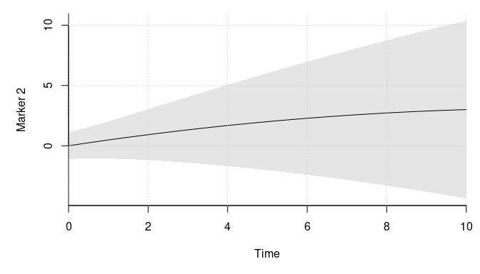<!-- -->

``` r
# the survival parameters
vcov_surv <- matrix(c(.2^2, .15^2, .15^2, .25^2), 2) # Xi 

fixef_surv <- list(c(-1, .25), .2)
# needs more parameters now
associations <- list(c(-.4, .6, -.4), c(-.7, .2, -1)) 
fixef_vary_surv <- list(c(.5, .1, -.2, .11),
                          c(-1, -.25))

# specify the dependence with the random effect from the markers
ders <- list(
  list(c(-1L, 0L), # cumulative and present value 
       0L),        # present value
  list(0L,         # present value
       c(0L, 1L))) # present value and derivative

b_funcs <- list(
  function(x) bs(x, knots = 5, Boundary.knots = c(0, 10)),
  function(x) ns(x, knots = 5, Boundary.knots = c(0, 10)))

# plot the log hazard with the 25%, 50% and 75% quantiles
library(SimSurvNMarker)

plot_surv(
  time_fixef = bs_term(knots = 5, Boundary.knots = c(0, 10)),
  time_rng = list(m1, m2), ders = ders[[1]],
  x_range = c(0, 10), fixef_vary = fixef_vary_surv[[1]],
  vcov_vary = vcov_vary, frailty_var = vcov_surv[1, 1], ps = c(.25, .5, .75),
  associations = associations[[1]], log_hazard_shift = fixef_surv[[1]][1],
  ylab = "Terminal event")
```

<!-- -->

``` r
plot_surv(
  time_fixef = ns_term(knots = 5, Boundary.knots = c(0, 10)),
  time_rng = list(m1, m2), ders = ders[[2]],
  x_range = c(0, 10), fixef_vary = fixef_vary_surv[[2]],
  vcov_vary = vcov_vary, frailty_var = vcov_surv[2, 2], ps = c(.25, .5, .75),
  associations = associations[[2]], log_hazard_shift = fixef_surv[[2]][1],
  ylab = "Observation process")
```

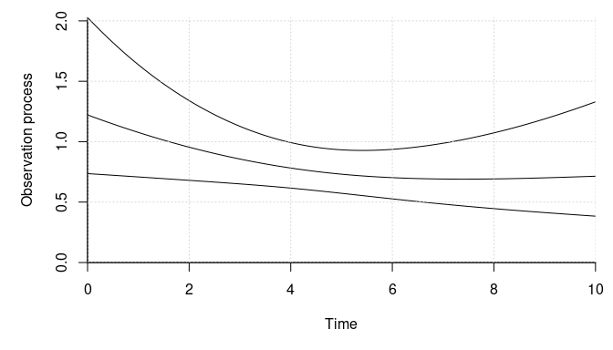<!-- -->

``` r
library(mvtnorm)
# simulates from the model by sampling a given number of individuals
sim_dat <- function(n_ids){
  # simulate the outcomes
  gl_dat <- get_gl_rule(100L)
  dat <- lapply(1:n_ids, function(id){
    # sample the terminal event time and the censoring time
    cens <- min(rexp(1, rate = 1/10), 10)
    U <- drop(rmvnorm(1, sigma = vcov_vary))

    frailties <- drop(rmvnorm(1, sigma = vcov_surv))
    Z1 <- c(1, runif(1, -1, 1))
    log_haz_offset <- sum(Z1 * fixef_surv[[1]]) + frailties[1]

    # assign the conditional hazard function
    expansion <- function(x, b_func)
      cbind(b_func(x), 
            t(U[1:2] %*% m_funcs[[1]](x, ders[[1]][[1]][1])),
            t(U[1:2] %*% m_funcs[[1]](x, ders[[1]][[1]][2])),
            t(U[3:4] %*% m_funcs[[2]](x, ders[[1]][[2]][1])))
    surv_func <- function(ti, fixef_vary_surv, associations, b_func){
      formals(expansion)$b_func <- b_func
      eval_surv_base_fun(
        ti = ti, omega = c(fixef_vary_surv, associations), b_func = expansion,
        gl_dat = gl_dat, delta = log_haz_offset)
    }

    # sample the survival time
    rng <- runif(1)
    root_func <- function(x, rng)
      rng - surv_func(x, fixef_vary_surv = fixef_vary_surv[[1]],
                      associations = associations[[1]], b_func = b_funcs[[1]])

    if(root_func(cens, rng) < 0){
      # the observation is censored
      y_terminal <- cens
      event <- 0
    } else {
      # find the event time
      root <- uniroot(root_func, c(0, cens), tol = 1e-6, rng = rng)
      y_terminal <- root$root
      event <- 1

    }

    terminal_outcome <- cbind(y = y_terminal, event = event, Z1 = Z1[2],
                              id = id)

    # clean up
    rm(list = setdiff(ls(), c("y_terminal", "terminal_outcome", "expansion",
                              "surv_func", "frailties", "U", "id")))

    # simulate the observation times
    Z2 <- 1
    log_haz_offset <- sum(Z2 * fixef_surv[[2]]) + frailties[2]

    expansion <- function(x, b_func)
      cbind(b_func(x), 
            t(U[1:2] %*% m_funcs[[1]](x, ders[[2]][[1]][1])),
            t(U[3:4] %*% m_funcs[[2]](x, ders[[2]][[2]][1])),
            t(U[3:4] %*% m_funcs[[2]](x, ders[[2]][[2]][2])))
    root_func <- function(x, left_trunc_surv, rng)
      rng - surv_func(x, fixef_vary_surv = fixef_vary_surv[[2]],
                      associations = associations[[2]], b_func = b_funcs[[2]]) /
      left_trunc_surv

    max_sample <- 1000L
    left_trunc_surv <- 1
    Z2 <- matrix(rep(Z2, each = max_sample), max_sample)
    event <- y <- lf_trunc <- rep(NA_real_, max_sample)
    lf_trunc_i <- 0
    for(i in 1:max_sample){
      # sample a random uniform variable and invert the survival function
      rng_i <- runif(1)
      lf_trunc[i] <- lf_trunc_i

      if(root_func(y_terminal, left_trunc_surv, rng_i) < 0){
        # the observation is right-censored and we can exit
        y[i] <- y_terminal
        event[i] <- 0
        break
      }

      # we need to invert the survival function to find the observation time
      root <- uniroot(root_func, c(lf_trunc_i, y_terminal), tol = 1e-6,
                      left_trunc_surv = left_trunc_surv, rng = rng_i)
      lf_trunc_i <- y[i] <- root$root
      event[i] <- 1
      left_trunc_surv <- surv_func(
        y[i], fixef_vary_surv = fixef_vary_surv[[2]], associations = associations[[2]],
        b_func = b_funcs[[2]])
    }

    colnames(Z2) <- paste0("Z", 1:NCOL(Z2) - 1L)
    obs_process <- cbind(lf_trunc = lf_trunc[1:i], y = y[1:i],
                         event = event[1:i], Z2[1:i, -1, drop = FALSE],
                         id = id)

    # clean up
    rm(list = setdiff(ls(), c("terminal_outcome", "U", "id",
                              "obs_process")))

    # sample the number of outcomes and the fixed effect covariates
    obs_time <- c(0, obs_process[obs_process[, "event"] == 1, "y"])
    n_obs <- length(obs_time)
    X1 <- cbind(1, rnorm(n_obs))
    X2 <- matrix(1, n_obs)
    colnames(X1) <- paste0("X1_", 1:NCOL(X1) - 1L)
    colnames(X2) <- paste0("X2_", 1:NCOL(X2) - 1L)
    X <- list(X1, X2)

    # sample the outcomes
    eta <- sapply(1:2, function(i)
      X[[i]] %*% fixef_marker[[i]] +
        drop(t(g_funcs[[i]](obs_time))) %*% fixef_vary_marker[[i]] +
        drop(t(m_funcs[[i]](obs_time))) %*% U[1:2 + (i == 2) * 2])

    ys <- eta + rmvnorm(n_obs, sigma = vcov_marker)
    colnames(ys) <- paste0("Y", 1:2)

    # mask some observations
    do_mask <- sample.int(3L, n_obs, replace = TRUE)
    ys[do_mask == 2, 1] <- NA
    ys[do_mask == 3, 2] <- NA

    X <- do.call(cbind, lapply(X, function(x) x[, -1, drop = FALSE]))
    marker_data <- cbind(ys, X, time = obs_time, id = id)

    return(list(marker_data = marker_data, obs_process = obs_process,
                terminal_outcome = terminal_outcome))
  })

  # combine the data and return
  marker_data <- as.data.frame(do.call(
    rbind, lapply(dat, `[[`, "marker_data")))
  marker_data$id <- as.integer(marker_data$id)
  # the order does not matter
  marker_data <- marker_data[sample.int(NROW(marker_data)), ]

  obs_process <- as.data.frame(do.call(
    rbind, lapply(dat, `[[`, "obs_process")))
  obs_process$id <- as.integer(obs_process$id)
  # the order does not matter
  obs_process <- obs_process[sample.int(NROW(obs_process)), ]

  terminal_outcome <- as.data.frame(do.call(
    rbind, lapply(dat, `[[`, "terminal_outcome")))
  terminal_outcome$id <- as.integer(terminal_outcome$id)
  # the order does not matter
  terminal_outcome <- terminal_outcome[sample.int(NROW(terminal_outcome)), ]

  list(marker_data = marker_data, obs_process = obs_process,
       terminal_outcome = terminal_outcome)
}

# sample a moderately large data set
set.seed(2)
dat <- sim_dat(1000L)

# we show a few properties of the data below
mean(dat$terminal_outcome$event) # mean event rate
#> [1] 0.77
sum(dat$obs_process$event) # number of observed marker less the individuals
#> [1] 2425
NROW(dat$marker_data) # number of observed marker
#> [1] 3425

# distribution of observed marker per individual
proportions(table(table(dat$obs_process$id)))
#> 
#>     1     2     3     4     5     6     7     8     9    10    11    12    13 
#> 0.319 0.190 0.141 0.109 0.078 0.041 0.033 0.027 0.013 0.012 0.015 0.003 0.004 
#>    14    16    17    27    29    31    38 
#> 0.005 0.003 0.003 0.001 0.001 0.001 0.001

# show data for one individual
subset(dat$marker_data, id == 1)
#>          Y1    Y2     X1_1   time id
#> X.6      NA 8.382 -0.56843 7.8724  1
#> X.3  0.7605    NA -0.97556 3.6495  1
#> X.7 -3.5564 9.325 -1.03442 8.4949  1
#> X.2 -0.5523    NA -1.11525 0.4897  1
#> X.9 -3.9194 9.798 -0.98139 9.5827  1
#> X.1      NA 1.726 -0.36632 0.4271  1
#> X        NA 1.987 -0.02815 0.0000  1
#> X.4  4.1065 6.374  1.12102 4.9005  1
#> X.8 -1.5241 9.405 -0.53302 8.6015  1
#> X.5  0.3933    NA  0.32444 7.5675  1
subset(dat$obs_process, id == 1)
#>    lf_trunc       y event id
#> 8    8.4949  8.6015     1  1
#> 9    8.6015  9.5827     1  1
#> 2    0.4271  0.4897     1  1
#> 1    0.0000  0.4271     1  1
#> 7    7.8724  8.4949     1  1
#> 10   9.5827 10.0000     0  1
#> 5    4.9005  7.5675     1  1
#> 6    7.5675  7.8724     1  1
#> 4    3.6495  4.9005     1  1
#> 3    0.4897  3.6495     1  1
subset(dat$terminal_outcome, id == 1)
#>    y event      Z1 id
#> 1 10     0 -0.6384  1

# estimate the model with this package. Get the object we need for the
# optimization
marker_1 <- marker_term(
  Y1 ~ X1_1, id = id, subset(dat$marker_data, !is.na(Y1)),
  time_fixef = ns_term(time, knots = c(3.33, 6.67), Boundary.knots = c(0, 10)),
  time_rng = ns_term(time, knots = numeric(), Boundary.knots = c(0, 10),
                     intercept = TRUE))
marker_2 <- marker_term(
  Y2 ~ 1, id = id, subset(dat$marker_data, !is.na(Y2)),
  time_fixef = poly_term(time, degree = 2, raw = TRUE),
  time_rng = poly_term(time, degree = 1, raw = TRUE, intercept = TRUE))

library(survival)
surv_terminal <- surv_term(
  Surv(y, event) ~ Z1, id = id, dat$terminal_outcome,
  time_fixef = bs_term(y, knots = 5, Boundary.knots = c(0, 10)), 
  ders = ders[[1]])
surv_obs <- surv_term(
  Surv(lf_trunc, y, event) ~ 1, id = id, dat$obs_process,
  time_fixef = ns_term(y, knots = 5, Boundary.knots = c(0, 10)), 
  ders = ders[[2]])

comp_obj <- joint_ms_ptr(markers = list(marker_1, marker_2),
                         survival_terms = list(surv_terminal, surv_obs),
                         max_threads = 4L)
rm(marker_1, marker_2, surv_terminal, surv_obs)

# get the starting values
system.time(start_val <- joint_ms_start_val(comp_obj))
#>    user  system elapsed 
#>  21.114   0.012   5.344

# lower bound at the starting values
print(-attr(start_val, "value"), digits = 8)
#> [1] -7950.3587

# check that the gradient is correct
f <- function(x){
  start_val[seq_along(x)] <- x
  joint_ms_lb(comp_obj, start_val)
}

all.equal(numDeriv::grad(f, head(start_val, 39 + 2 * 27)),
          head(joint_ms_lb_gr(comp_obj, start_val), 39 + 2 * 27), 
          tolerance = 1e-6)
#> [1] TRUE

# find the maximum lower bound estimate
system.time(opt_out <- joint_ms_opt(comp_obj, par = start_val, max_it = 1000L,
                                    pre_method = 1L, cg_tol = .2, c2 = .1))
#>    user  system elapsed 
#> 144.015   0.052  36.021
opt_out$info # convergence code (0 == 'OK')
#> [1] 0
print(-opt_out$value, digits = 8) # maximum lower bound value
#> [1] -7596.267

# compare the estimates with the actual values. Start with the fixed effects
fmt_ests <- joint_ms_format(comp_obj, opt_out$par)

# the parameters for the first marker
fmt_ests$markers[[1]]
#> $fixef
#> [1] -0.4305  2.0078
#> 
#> $fixef_vary
#> [1]  1.354  1.218 -1.802

fixef_marker[[1]] # true values
#> [1] -0.5  2.0
fixef_vary_marker[[1]] # true values
#> [1]  1.4  1.2 -2.1

# the parameters for the second marker
fmt_ests$markers[[2]]
#> $fixef
#> [1] 0.99
#> 
#> $fixef_vary
#> [1]  0.53134 -0.02203
fixef_marker[[2]] # true values
#> [1] 1
fixef_vary_marker[[2]] # true values
#> [1]  0.50 -0.02

# the fixed effects for the survival outcome and the association parameters
# for the terminal event
fmt_ests$survival[[1]]
#> $fixef
#> [1] -1.0825  0.2979
#> 
#> $fixef_vary
#> [1]  0.73677  0.06267 -0.13962 -0.42780
#> 
#> $associations
#> [1] -0.4080  0.5438 -0.4289
fixef_surv[[1]]
#> [1] -1.00  0.25
fixef_vary_surv[[1]]
#> [1]  0.50  0.10 -0.20  0.11
associations[[1]]
#> [1] -0.4  0.6 -0.4

# same for the observation process
fmt_ests$survival[[2]]
#> $fixef
#> [1] 0.2207
#> 
#> $fixef_vary
#> [1] -1.273 -0.288
#> 
#> $associations
#> [1] -0.7098  0.1848 -0.7879
fixef_surv[[2]]
#> [1] 0.2
fixef_vary_surv[[2]]
#> [1] -1.00 -0.25
associations[[2]]
#> [1] -0.7  0.2 -1.0

# the parameters for covariance matrix of the random effects
fmt_ests$vcov$vcov_vary
#>          [,1]    [,2]     [,3]     [,4]
#> [1,]  0.34409  0.2390 -0.07326 -0.03133
#> [2,]  0.23903  2.1588 -0.25940 -0.11215
#> [3,] -0.07326 -0.2594  0.27219  0.10388
#> [4,] -0.03133 -0.1122  0.10388  0.12939
vcov_vary # the true values
#>       [,1]  [,2]  [,3]  [,4]
#> [1,]  0.35  0.08 -0.05  0.01
#> [2,]  0.08  1.92 -0.24 -0.04
#> [3,] -0.05 -0.24  0.32  0.09
#> [4,]  0.01 -0.04  0.09  0.12

# the parameters for the error term covariance matrix
fmt_ests$vcov$vcov_marker
#>         [,1]    [,2]
#> [1,] 0.33312 0.09298
#> [2,] 0.09298 0.16214
vcov_marker
#>      [,1] [,2]
#> [1,] 0.36 0.10
#> [2,] 0.10 0.16

# the parameters for the frailty covariance matrix
fmt_ests$vcov$vcov_surv
#>          [,1]     [,2]
#> [1,]  0.05505 -0.04439
#> [2,] -0.04439  0.03742
vcov_surv
#>        [,1]   [,2]
#> [1,] 0.0400 0.0225
#> [2,] 0.0225 0.0625
```

## Technical Details

We provide a few technical details in this section. The concatenated
coefficient is given by

  
 \\\\ \\text{vec}(\\Psi) \\\\ \\text{vec}(\\Xi)
\\end{pmatrix}")  

where
") is the vectorization function that stacks the
column of a matrix on top of each other.
 is with the parameters from the variational
approximation. We work with log Cholesky decompositions of the
covariance matrices in practice. The `joint_ms_format` is a utility
functions which returns a list with each of parameter separately.

There are different types of terms in the lower bound in the GVA. We
cover the types below. The lower bound has many parameters even with a
moderate amount of parameters. However, we quickly optimize the lower
bound using the [psqn package](https://github.com/boennecd/psqn).

## Kullback–Leibler Divergence Term

In the GVA, we assume that the conditional distribution of ^\\top") is a normal distribution
with mean
 and covariance matrix
. One of the terms in the lower bound of the GVA is the
Kullback–Leibler (KL) divergence term between the unconditional
distribution of ^\\top") and the assumed
conditional distribution. This term is given by

  
}^\\top\\Xi^{-1}\\vec\\zeta_{i,(-1:R)} \\\\- \\text{tr}\\Omega_{i,1:R,1:R}\\Psi^{-1}- \\text{tr}\\Omega_{i,(-1:R),(-1:R)}\\Xi^{-1}+ R + H\\Big)\\end{multline*}")  

where
") returns the trace of a matrix. Thus, the
derivatives w.r.t.
,
,
,
 are respectively

  
")  

  
\\Psi^{-1}")  

  
}\\vec\\zeta_{i,(-1:R)}^\\top+ \\Omega_{i,(-1:R),(-1:R)} - \\Xi)\\Xi^{-1}.")  

  
  

## Marker Terms

The log conditional density term of observation
 of
individual  at time
 is

  
}\\left(\\vec y_{ij}; X_i\\vec\\gamma + G(s_{ij})\\vec\\beta + M(s_{ij})\\vec w, \\Sigma\\right)\\right)\\phi^{(R)}\\left(\\vec w; \\vec\\zeta_{i,1:R}, \\Omega_{i,1:R,1:R}\\right) d\\vec w")  
which gives

  
\\vec\\beta - M(s_{ij})\\vec\\zeta_{i,1:R}\\right)^\\top \\\\ \\Sigma^{-1}\\left(\\vec y_{ij} - X_i\\vec\\gamma - G(s_{ij})\\vec\\beta - M(s_{ij})\\vec\\zeta_{i,1:R}\\right) - \\frac{1}{2}\\text{tr}\\Sigma^{-1}M(s_{ij})\\Omega_{i,1:R,1:R}M(s_{ij})^\\top. \\end{multline*}")  

## Survival Outcomes

Let  be the minimum of the censoring time or the
observed event time and  be event indicators. The the lower bound terms
for the th time to event is

  
-\\int_0^{t_{ik}}  h_{ik}(s\\mid \\vec w_{1:R}, w_{R + k})ds \\right)\\phi^{(R + H)}(\\vec w; \\vec\\zeta_i, \\Omega_i)d\\vec w.")  

Left-truncation is eaisly handled by replacing the zero in the lower
limit by the left-truncation point. The log hazard term gives the
following lower bound terms

  
 +  \\vec\\alpha_k^\\top M(t_{ik})\\vec\\zeta_{i,1:R} + \\zeta_{i,R + k}\\right).")  

As for the expected cumulative hazard term, assume that we can
interchange the order of integration. Then the lower bound term is

  
\\int_0^{t_{ij}} \\exp\\left(\\omega_k^\\top \\vec b_k(s) +  \\vec\\alpha_k^\\top M(s)\\vec\\zeta_{i,1:R} +\\frac{1}{2}  (\\vec\\alpha_k^\\top, 1) O_{ik}(s)\\begin{pmatrix} \\vec\\alpha_k \\\\ 1 \\end{pmatrix}\\right) ds")  

where

  
 = \\begin{pmatrix}M(s) & 0 \\\\ 0 & 1\\end{pmatrix}
  \\Omega_{(1:R, R + k), (1:R, R + k)}
    \\begin{pmatrix}M(s)^\\top & 0 \\\\ 0 & 1\\end{pmatrix}.")
